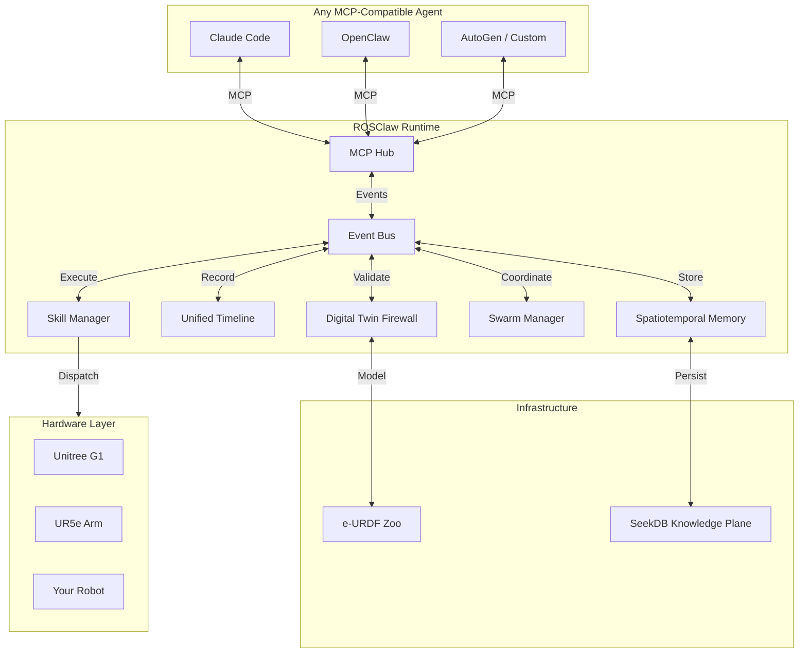

<div align="center">

# ROSClaw

**The Open Infrastructure for Physical Intelligence**

*Grounding AGI into the Physical World.*

[](https://opensource.org/licenses/Apache-2.0)
[](https://docs.ros.org/)
[](https://mujoco.org/)
[](https://modelcontextprotocol.io/)

[English](README.md) • [中文](README.zh.md) • [Architecture](#-architecture) • [Quick Start](#-quick-start)

<br/>

> *"Teach Once, Embody Anywhere. Share Skills, Shape Reality."*

</div>

<br/>

> **Project Status: V1.0 — Grounding Runtime**
>
> ROSClaw is **NOT** just another agent framework, nor is it a simple LLM-to-ROS API wrapper. It is the **foundational infrastructure** designed to solve the ultimate bottleneck of AGI: **The Physical Grounding Problem.**
>
> We provide the definitive Runtime Environment that transforms abstract token-generation into safe, deterministic, and self-evolving physical interactions.

## The Vision: Beyond Agent Frameworks

If OpenClaw gave AI agents the ability to reason, **ROSClaw gives them gravity.**

In the history of artificial intelligence, the **"Symbol Grounding Problem"** is the biggest obstacle on the road to AGI. A large language model knows the word "apple," but it does not know the weight of an apple, its texture, or the sound it makes when it falls to the ground.

**The entire purpose of ROSClaw is to solve the Grounding problem for large models in the three-dimensional universe.**

We are building an **Open Ecosystem for Physical Skills**. If a developer in Tokyo teaches a robotic arm the "precision screwdriving" skill via ROSClaw, a factory worker in Berlin can instantly download that skill and deploy it on a completely different humanoid robot — **no re-programming required**.

> **The future we imagine**: A skill marketplace where physical intelligence flows as freely as software — teach once, embody everywhere.

---

## Architecture of Grounding

ROSClaw operates through an interconnected suite of deterministic engines, unified by an **Event Bus** that ensures complete module decoupling:

### 1. e-URDF (Physical Grounding)
The "Device Tree" of Physical AI. Defines the absolute kinematic and dynamic limits of any robotic embodiment. Every robot carries its **Physical DNA** — mass, limits, sensors, safety envelopes.

### 2. Digital Twin Firewall (Action Grounding)
A MuJoCo-powered digital twin that intercepts, simulates, and aligns LLM hallucinations with Newtonian physics *before* execution. Every motion is validated in simulation; if collision or torque overload is predicted, the action is blocked and the Agent self-corrects.

### 3. Praxis Capture (Timeline Grounding)
High-frequency MCAP recorders that bind 1000Hz sensorimotor data with 1Hz LLM Chain-of-Thought on a unified time axis. Event-driven ring buffers achieve 100x storage optimization while keeping 100% of valuable data.

### 4. Spatiotemporal Memory (Experience Grounding)
A SeekDB-backed hippocampus that converts raw physical failures into structured causal graphs. Includes:
- **World Object Store** with persistent identity and scene graphs
- **Trajectory Memory** with DTW similarity search
- **Object Permanence** — occluded objects do not disappear; confidence decays over time until the object is either re-detected or marked missing
- **Cognitive Search** — semantic + spatial + temporal retrieval across memory atoms

### 5. Swarm Coordination (Collaboration Grounding)
Multi-robot coordination through the EventBus. Task allocation, role assignment, and DDS-native reflex handshake for physical collaboration.

---

## Architecture



**Key Insight**: All modules communicate exclusively through the EventBus. No direct module-to-module calls. This ensures complete decoupling and enables any agent to connect without hardware-specific knowledge.

---

## Quick Start

### 1. Install ROSClaw

```bash
pip install rosclaw
```

### 2. Start the Runtime

```python
from rosclaw.core import Runtime, RuntimeConfig

config = RuntimeConfig(
    robot_id="ur5e_001",
    robot_model_path="path/to/robot.urdf",
    enable_firewall=True,
    enable_memory=True,
)

runtime = Runtime(config)
runtime.initialize()
runtime.start()
```

### 3. Connect via MCP

```json
{
  "mcpServers": {
    "rosclaw": {
      "command": "rosclaw-hub",
      "args": ["--enable-digital-twin"]
    }
  }
}
```

---

## Roadmap

| Sprint | Focus | Status |
|--------|-------|--------|
| **0** | Architecture Freeze (RFC-0001) | Done |
| **1** | Physical Foundation (e-URDF, CLI, MCP) | Done |
| **2** | Grounding Runtime (Event Bus, Agent Runtime) | Done |
| **3** | Action Grounding (Firewall, MuJoCo) | Done |
| **4** | Praxis Capture (Timeline, MCAP) | Done |
| **5** | Spatiotemporal Memory (SeekDB, Object Permanence) | Done |
| **6** | Knowledge & Recovery (How, Know) | Planned |
| **7** | Evolution Loop (Flywheel, Auto) | Planned |
| **8** | Swarm Intelligence (DDS Reflex) | Planned |
| **9** | Darwin Arena (Evaluation) | Planned |

---

## Safety Architecture

### Digital Twin Firewall

Every motion is validated in MuJoCo before physical execution:

```python
from rosclaw.core import Runtime, RuntimeConfig

config = RuntimeConfig(
    robot_model_path="ur5e.xml",
    safety_level="STRICT",
)
runtime = Runtime(config)
runtime.initialize()
```

### Validation Layers

- **e-URDF Soft Limits**: Joint position, velocity, torque envelopes
- **MuJoCo Collision**: Self-collision and environment collision detection
- **Semantic Safety**: Keepout zones, workspace boundaries, smoothness checks

---

## The Grounding Closed Loop

```text
Physical World
        ↓
e-URDF DNA (Physical Grounding)
        ↓
Agent Runtime (LLM/MCP)
        ↓
Firewall (Action Grounding)
        ↓
Practice (Timeline Grounding)
        ↓
SeekDB (Knowledge Plane)
        ↓
Memory (Experience Grounding)
        ↓
How / Auto (Skill Grounding)
        ↓
Flywheel (Evolution Grounding)
        ↓
Swarm (Collaboration Grounding)
        ↓
Darwin (Evaluation Grounding)
        ↓
Physical World
```

**Our Mission**: Transform physical interactions into structured experiences, experiences into memory, memory into skills, and skills into evolution.

---

<div align="center">
  <b>Grounding AGI into the Physical World.</b><br>
  <a href="https://rosclaw.io">rosclaw.io</a>
</div>
