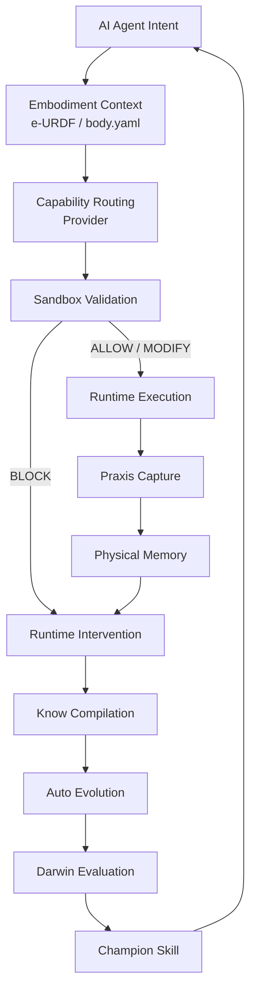

<div align="center">

# ROSClaw

### Self-Evolving Runtime Infrastructure for Physical AI & Embodied Agents

**Ground AI agents into robot bodies. Validate every action. Learn from every trace. Evolve every skill.**

[](LICENSE)
[](https://www.python.org/)
[](https://docs.ros.org/)
[](https://mujoco.org/)
[](https://modelcontextprotocol.io/)
[](https://github.com/ros-claw/rosclaw)
[](mailto:ai@rosclaw.io)

[English](README.md) • [中文](README.zh.md) • [Quick Start](QUICKSTART.md) • [Architecture](ARCHITECTURE.md) • [Docs](docs/) • [Contact](mailto:ai@rosclaw.io)

</div>

---

ROSClaw is an open runtime infrastructure layer for **Physical AI** and **embodied agents**.

It connects AI agents, robot embodiments, sandbox safety, capability providers, praxis capture, physical memory, runtime intervention, and benchmark-driven skill evolution into one coherent operating layer.

> From agent intent → validated action → physical trace → memory → intervention → evolved skill.

```bash
curl -sSL https://rosclaw.io/get | bash
rosclaw firstboot
```

---

## What is ROSClaw?

ROSClaw is **not** a chatbot framework.  
It is **not** a thin LLM-to-ROS wrapper.  
It is **not** just another robotics toolkit.

ROSClaw provides the missing runtime layer between AI agents and the physical world:

- **Embodiment grounding** — describe robot bodies, sensors, actuators, constraints, safety limits, and capabilities through e-URDF.
- **Sandbox-before-reality safety** — validate physical actions in digital twins before they reach real hardware.
- **Capability routing** — connect LLMs, VLMs, VLAs, VLNs, world models, classical robotics algorithms, skill policies, critics, and embeddings as routable physical capabilities.
- **Praxis capture** — record physical execution traces, robot states, sensor streams, model decisions, sandbox decisions, failures, and recoveries.
- **Physical memory** — store spatiotemporal experience, success patterns, failure evidence, and reusable physical knowledge.
- **Runtime intervention** — inject minimal, evidence-backed corrections when an agent is stuck, unsafe, or regressing.
- **Self-evolving skills** — evaluate, patch, benchmark, promote, and roll back skills through a closed evolution loop.

---

## Why Physical AI Needs Runtime Infrastructure

Large models can plan, reason, and generate code. But physical intelligence requires more than tokens.

An embodied agent must know:

- what body it has;
- what sensors and actuators it owns;
- what actions are safe;
- what happened during execution;
- why a skill failed;
- how to recover;
- how to improve without breaking safety.

ROSClaw turns these requirements into a unified runtime.

---

## The ROSClaw Closed Loop

```text
Agent Intent
  ↓
Embodiment Context
  ↓
Capability Routing
  ↓
Sandbox Validation
  ↓
Physical Execution
  ↓
Praxis Capture
  ↓
Physical Memory
  ↓
Runtime Intervention
  ↓
Knowledge Compilation
  ↓
Auto Evolution
  ↓
Darwin Evaluation
  ↓
Champion Skill
  ↓
Safer Next Execution
```

Core principle:

> **Every physical action should be grounded, validated, recorded, remembered, repaired, and improved.**

---

## Quick Start

### 1. Install

```bash
curl -sSL https://rosclaw.io/get | bash
```

### 2. First boot

```bash
rosclaw firstboot
```

### 3. Check health

```bash
rosclaw doctor
```

### 4. Run a sandbox demo

```bash
rosclaw sandbox run --robot sim_ur5e --world tabletop --task reach
```

### 5. Open dashboard

```bash
rosclaw dashboard --open
```

For detailed setup, see [QUICKSTART.md](QUICKSTART.md).

---

## First Boot Flow

`rosclaw firstboot` initializes a local Physical-AI runtime workspace:

1. Creates `~/.rosclaw`
2. Generates default runtime configuration
3. Checks Python, Docker, GPU, ROS 2, and simulation dependencies
4. Initializes local-only mode by default
5. Optionally configures LLM / VLM / VLA providers
6. Optionally initializes an embodiment profile
7. Optionally connects Claude Code or another MCP-compatible agent
8. Runs a local sandbox smoke test
9. Prints the next recommended command

See [docs/FIRSTBOOT.md](docs/FIRSTBOOT.md) for details.

---

## Developer Install

Prefer to hack on ROSClaw itself?

```bash
git clone https://github.com/ros-claw/rosclaw.git
cd rosclaw
make setup
make test
```

See [INSTALL.md](INSTALL.md) for detailed development setup.

---

## CLI Map

| Goal | Command | Status |
|---|---|---|
| Initialize ROSClaw | `rosclaw firstboot` | Stable |
| Check environment health | `rosclaw doctor` | Stable |
| Initialize an agent workspace | `rosclaw agent init claude-code` | Stable |
| Initialize a robot body profile | `rosclaw body init --robot unitree-g1` | Stable |
| Link an e-URDF profile | `rosclaw body link-eurdf unitree-g1` | Stable |
| Configure model providers | `rosclaw provider init` | Planned |
| Route a capability request | `rosclaw provider route --capability vision_language_action` | Planned |
| Run sandbox validation | `rosclaw sandbox run --robot sim_ur5e --world tabletop --task reach` | Stable |
| Start praxis capture | `rosclaw practice start --sources dds,ros2,camera,agent,provider,sandbox,runtime` | Planned |
| Query physical memory | `rosclaw memory query "last failed grasp near red cup"` | Stable |
| Ask for runtime repair | `rosclaw how advise --task g1_kick_ball --failure torso_pitch_overshoot` | Planned |
| Compile task knowledge | `rosclaw know compile --task g1_kick_ball` | Stable |
| Run evolution experiments | `rosclaw auto run --suite tabletop_grasp` | Planned |
| Evaluate skill candidates | `rosclaw darwin eval --skill pick_cube` | Research |
| Open dashboard | `rosclaw dashboard --open` | Stable |
| Search assets | `rosclaw hub search g1` | Stable |
| Install an asset | `rosclaw hub install <asset>` | Planned |

Some commands are **Planned** or **Research** depending on module status. See [docs/CLI.md](docs/CLI.md).

---

## Core Runtime Modules

### Embodiment Layer

| Module | Role |
|---|---|
| `e-urdf-zoo` | Physical DNA registry for robot embodiment, safety limits, capabilities, and simulation metadata |
| Body / Embodiment Runtime | Local robot instance state, calibration, maintenance, and embodiment context |

### Runtime & Safety Layer

| Module | Role |
|---|---|
| `rosclaw-runtime` | Lifecycle, configuration, plugins, event routing, and orchestration |
| `rosclaw-sandbox` | Simulation-first validation, replay, and sandbox-before-reality safety |
| `rosclaw-provider` | Capability routing across models, policies, robotics algorithms, and tools |

### Practice & Memory Layer

| Module | Role |
|---|---|
| `rosclaw-practice` | Physical timeline capture: robot state, sensors, actions, tool calls, sandbox decisions, failures |
| `rosclaw-memory` | Spatiotemporal physical memory, failure evidence, success patterns, and reusable experience |
| SeekDB Knowledge Plane | Structured storage for robot, skill, provider, episode, failure, and evidence records |

### Intervention & Knowledge Layer

| Module | Role |
|---|---|
| `rosclaw-how` | Runtime intervention: minimal evidence-backed repair suggestions |
| `rosclaw-know` | Knowledge compiler: papers, docs, traces, failures, constraints, and task cards |

### Evolution & Evaluation Layer

| Module | Role |
|---|---|
| `rosclaw-auto` | Self-evolution control plane: proposals, patches, experiments, champions, dead ends |
| `rosclaw-darwin` | Benchmark pressure, multi-seed validation, regression testing, and skill promotion gates |

### Developer & Observability Layer

| Module | Role |
|---|---|
| `rosclaw-dashboard` | Physical trace viewer, runtime observability, sandbox replay, memory, and evolution dashboard |
| `rosclaw-hub` | Physical-AI asset distribution and lifecycle management |
| `rosclaw-forge` | Asset compiler for SDKs, ROS interfaces, provider manifests, MCP servers, and skill bundles |

---

## Hub & Assets

ROSClaw Hub is a **Physical-AI Asset Hub** for skills, providers, hardware MCP servers, digital twins, e-URDF profiles, and cognitive wikis.

- **Skills** — reusable embodied task policies, recovery strategies, and skill graphs.
- **Providers** — LLM, VLM, VLA, VLN, world model, critic, embedding, and classical robotics providers.
- **Hardware MCP servers** — agent-facing interfaces for robot bodies, sensors, tools, and lab devices.
- **Digital twins** — simulation worlds, robot assets, validation scenes, and replay environments.
- **e-URDF profiles** — robot embodiment definitions, safety envelopes, capabilities, and simulation metadata.
- **Cognitive wikis** — task cards, failure taxonomies, constraints, evidence, and engineering knowledge.

```bash
rosclaw hub login --registry https://hub.rosclaw.io --token $TOKEN
rosclaw hub sync
rosclaw hub search g1
rosclaw hub validate ./assets/manifest.yaml
```

Local-only usage does not require a ROSClaw Cloud key. Cloud sync, private assets, and team-managed registries may require authentication.

See [docs/hub/README.md](docs/hub/README.md) and [docs/ASSETS.md](docs/ASSETS.md).

---

## Example: A Full Physical Intelligence Loop

```bash
./rosclaw demo tabletop-grasp --robot-id ur5e
```

What happens:

```text
1. Agent receives task: "pick up the red cup"
2. Provider routes to perception and skill capabilities
3. Memory retrieves similar grasping experience
4. Skill provider generates grasp plan
5. Sandbox validates candidate motion
6. Runtime executes safe action
7. Practice records the full physical timeline
8. Critic evaluates success or failure
9. How generates recovery guidance if needed
10. Auto proposes a skill improvement after repeated failures
11. Darwin evaluates the candidate skill
12. A champion skill is promoted if it passes all gates
```

---

## Safety Model

ROSClaw follows one strict rule:

> **No model output should directly control a robot.**

Every physical action must pass through:

```text
Agent Intent
  ↓
Provider Schema
  ↓
Embodiment Constraints
  ↓
Sandbox Validation
  ↓
Runtime Guard
  ↓
Robot Controller
```

Hard rules:

- VLA outputs are **proposals**, not raw motor commands.
- World models are **previews**, not safety proofs.
- MCP is an **agent tool interface**, not a real-time control bus.
- Auto-generated skills must pass **sandbox validation** before execution.
- Code patches require **human review** before production use.
- Safety configuration changes require **explicit approval**.
- Every promoted skill must be **versioned and rollback-safe**.

See [docs/SAFETY.md](docs/SAFETY.md) for the full safety model.

---

## Architecture



See [ARCHITECTURE.md](ARCHITECTURE.md) for the full system design.

---

## Supported Integrations

ROSClaw is designed to integrate with:

- ROS 2 and robot middleware
- MCP-compatible agents
- Claude Code and custom agent runtimes
- LLM / VLM / VLA / VLN providers
- OpenAI-compatible model endpoints
- MuJoCo and other local simulation backends
- Digital twin and replay environments
- RLDS / LeRobot-style data export pipelines
- MCAP / Parquet / JSONL trace formats

Integration status varies by module. See [docs/CLI.md](docs/CLI.md) and [ARCHITECTURE.md](ARCHITECTURE.md).

---

## Documentation

- [Quick Start](QUICKSTART.md)
- [Installation](INSTALL.md)
- [First Boot](docs/FIRSTBOOT.md)
- [Architecture](ARCHITECTURE.md)
- [CLI Reference](docs/CLI.md)
- [Safety Model](docs/SAFETY.md)
- [Physical-AI Assets](docs/ASSETS.md)
- [Hub](docs/hub/README.md)
- [Contributing](CONTRIBUTING.md)

---

## Roadmap

### Current

- Local runtime workspace
- e-URDF based embodiment profiles
- Sandbox validation
- Capability provider routing
- Practice trace capture
- Hub asset validation and local registry workflows
- Dashboard and replay foundations
- Test suite and benchmark scaffolding

### In Progress

- First Boot productization
- Hardware MCP auto-install flow
- Physical memory closed-loop evaluation
- How runtime intervention integration
- Provider container lifecycle
- Dashboard physical trace viewer
- Darwin benchmark-driven skill promotion

### Research

- Cross-embodiment skill transfer
- VLA / VLN / world model provider orchestration
- Long-horizon physical memory
- Self-evolving embodied skills
- Sim-to-real promotion gates
- Multi-agent physical collaboration

---

## Contributing

We welcome contributions in:

- Robot embodiment profiles
- e-URDF assets
- Hardware MCP servers
- Capability providers
- Sandbox worlds
- Benchmark tasks
- Physical memory evaluators
- Runtime intervention policies
- Skill evolution pipelines
- Documentation and tutorials

See [CONTRIBUTING.md](CONTRIBUTING.md).

---

## Contact

Interested in ROSClaw, Physical AI infrastructure, embodied agents, robot safety, physical memory, runtime intervention, or self-evolving skills?

Contact: [**ai@rosclaw.io**](mailto:ai@rosclaw.io)

We welcome research collaborations, robot platform integrations, provider integrations, benchmark contributions, and industrial Physical-AI use cases.

---

## License

MIT License.

---

<div align="center">

**ROSClaw — Self-Evolving Runtime Infrastructure for Physical AI.**

</div>
