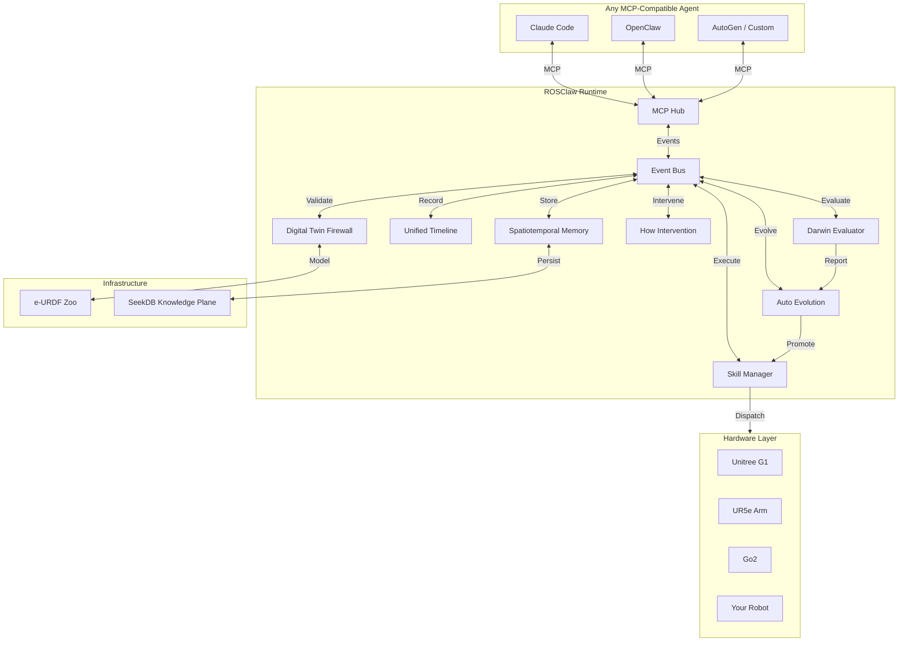

<div align="center">

# ROSClaw

**The Open Infrastructure for Physical Intelligence**

*Grounding AI Agents into the Physical World.*

[](LICENSE)
[](https://www.python.org/)
[](https://docs.ros.org/)
[](https://mujoco.org/)
[](https://modelcontextprotocol.io/)
[](https://github.com/ros-claw/rosclaw/releases)

[English](README.md) • [中文](README.zh.md) • [Architecture](#architecture) • [Quick Start](#-quick-start) • [Docs](docs/)

<br/>

> **Teach Once. Embody Anywhere. Evolve Continuously.**

</div>

---

## What is ROSClaw?

ROSClaw is **not** another chatbot framework. It is **not** a thin LLM-to-ROS wrapper. It is **not** a collection of random robotics tools.

ROSClaw is an **open infrastructure layer for Physical Intelligence**: a runtime that connects AI agents, robot embodiments, simulation sandboxes, skill systems, multimodal providers, physical memory, and self-evolution loops into one coherent operating layer.

It is designed for the next generation of embodied agents that must not only reason, but also **act safely, remember physically, recover from failure, and improve over time**.

```
┌──────────────────────────────────────────────────────────────┐
│           External Cognitive Brains                          │
│     OpenClaw / Claude / GPT / Qwen / Custom Agents           │
└───────────────────────────┬──────────────────────────────────┘
                            │ MCP / SDK / AgentContext
                            ▼
┌──────────────────────────────────────────────────────────────┐
│           ROSClaw Runtime                                    │
│  AgentContext │ TaskContext │ SkillContext │ Trace           │
└───────────────────────────┬──────────────────────────────────┘
                            │
        ┌───────────────────┼───────────────────┐
        ▼                   ▼                   ▼
┌───────────────┐   ┌───────────────┐   ┌───────────────┐
│   Provider    │   │   Sandbox     │   │    Darwin     │
│  Capability   │   │  e-URDF /     │   │  Benchmark /  │
│   Router      │   │  MuJoCo /     │   │  Regression / │
│               │   │  Firewall     │   │  Evaluation   │
└───────┬───────┘   └───────┬───────┘   └───────────────┘
        │                   │
        └───────────┬───────┘
                    ▼
┌──────────────────────────────────────────────────────────────┐
│           Physical World / Simulator                         │
│        UR5e / G1 / Go2 / RealSense / IoT / MuJoCo            │
└───────────────────────────┬──────────────────────────────────┘
                            │
                            ▼
┌──────────────────────────────────────────────────────────────┐
│           Practice Capture                                   │
│   Unified Timeline / MCAP / JSONL / Video / Events           │
└───────────────────────────┬──────────────────────────────────┘
                            │
                            ▼
┌──────────────────────────────────────────────────────────────┐
│           SeekDB Knowledge Plane                             │
│  Robot │ Skill │ Provider │ Episode │ Failure │ Evidence    │
└───────────────┬────────────────────────────┬─────────────────┘
                │                            │
                ▼                            ▼
┌───────────────────────┐      ┌───────────────────────────────┐
│     Memory            │      │         Know                  │
│  Spatiotemporal       │      │  Physical-AI Knowledge        │
│  Failure / Success    │      │  Compiler                     │
│  Pattern / Causal     │      │  TaskCard / Pattern / Evidence│
└───────────┬───────────┘      └───────────────┬───────────────┘
            │                                  │
            └──────────────┬───────────────────┘
                           │
                           ▼
            ┌──────────────────────────────┐
            │      How  ←→  Auto           │
            │  Runtime Intervention        │
            │  Self-Evolution Control      │
            │  Proposal / Patch / Champion │
            └──────────────┬───────────────┘
                           │
                           ▼
                 ┌─────────────────┐
                 │  Skill Registry │
                 │  Versioned /    │
                 │  Champion /     │
                 │  Rollback-safe  │
                 └─────────────────┘
```

---

## Why ROSClaw?

Large language models can plan, write code, and reason over symbols. But physical intelligence requires more than tokens.

A physical agent must understand:

- What body it has;
- What sensors and actuators it owns;
- What actions are safe;
- What happened during execution;
- Why a skill failed;
- How to recover;
- How to improve the skill without breaking safety.

ROSClaw provides the missing infrastructure between high-level AI agents and the physical world.

---

## Core Principle

> **Every physical action should be grounded, validated, recorded, remembered, and improved.**

The full closed loop:

```
Physical Task
    ↓
Agent Intent
    ↓
Capability Provider
    ↓
Sandbox / Firewall Validation
    ↓
Runtime Execution
    ↓
Praxis Capture
    ↓
Spatiotemporal Memory
    ↓
Runtime Intervention (How)
    ↓
Knowledge Compilation (Know)
    ↓
Auto Evolution
    ↓
Champion Skill
    ↓
Safer Physical Task
```

---

## Architecture



**Key Insight**: All modules communicate exclusively through the EventBus. No direct module-to-module calls. This ensures complete decoupling and enables any agent to connect without hardware-specific knowledge.

---

## Key Modules

| Module | Role |
|--------|------|
| `rosclaw-runtime` | The lifecycle manager for the whole system. Owns configuration, plugins, health checks, event routing, and runtime orchestration. |
| `e-urdf-zoo` | The Physical DNA Registry. Defines robot embodiment, kinematics, dynamics, sensors, safety limits, capabilities, and simulation assets. |
| `rosclaw-provider` | The capability provider layer. Turns LLMs, VLMs, VLAs, VLNs, world models, skill policies, critics, and embeddings into routable physical capabilities. |
| `rosclaw-sandbox` | The physical simulation, validation, replay, and safety layer. Its `firewall` mode validates actions before execution. |
| `rosclaw-practice` | The praxis capture engine. Records unified physical timelines with sensorimotor traces, model decisions, tool calls, events, MCAP, and replay artifacts. |
| `rosclaw-memory` | The spatiotemporal memory system. Stores physical failures, success patterns, scene memory, trajectory memory, and causal experience graphs. |
| `rosclaw-how` | The runtime intervention controller. Injects minimal, evidence-backed guidance when an agent is stuck, unsafe, or regressing. |
| `rosclaw-know` | The physical-AI knowledge compiler. Turns papers, code, logs, trajectories, benchmark traces, and failures into structured engineering knowledge. |
| `rosclaw-auto` | The self-evolution control plane. Generates proposals, patches skills, runs experiments, evaluates candidates, promotes champions, and records dead ends. |
| `rosclaw-darwin` | The evaluation and evolution arena. Provides benchmark pressure, multi-seed validation, regression tests, and skill evaluation. |
| `rosclaw-forge` | The embodied asset compiler. Turns SDKs, ROS 2 interfaces, docs, and e-URDF profiles into MCP servers, skills, provider manifests, and asset bundles. |
| `rosclaw-dashboard` | The observability layer for runtime health, traces, sandbox replay, memory, interventions, and skill evolution. |

---

## What Makes ROSClaw Different?

### 1. Physical Grounding, Not Just Tool Calling

ROSClaw does not expose raw robot APIs directly to an LLM. Every action is grounded through robot embodiment, capability schemas, safety limits, and runtime context.

```
Token Intent → Capability Request → Safety Validation → Physical Execution
```

### 2. e-URDF as Physical DNA

ROSClaw treats robot embodiment as a first-class system primitive. An e-URDF profile defines:

- Robot structure;
- Joints, links, sensors, actuators;
- Safety envelopes;
- Tool frames;
- Workspace limits;
- Capabilities;
- Simulation assets;
- Benchmark metadata.

This allows the same skill to be adapted, validated, and transferred across different robot bodies.

### 3. Sandbox Before Reality

The `rosclaw-sandbox` module provides a simulation-first validation layer. Its firewall mode can block risky actions before they reach hardware.

Possible decisions:

```
ALLOW
BLOCK
MODIFY
REQUIRE_HUMAN_CONFIRMATION
```

Example result:

```json
{
  "decision": "BLOCK",
  "risk_score": 0.92,
  "reason": "Predicted collision between wrist_link and table",
  "violated_constraints": ["collision", "workspace_boundary"],
  "replay_id": "sandbox://replays/firewall_00042"
}
```

### 4. Practice Capture

ROSClaw records physical execution as structured praxis, not just logs. A single run can include:

- Robot state;
- Sensor snapshots;
- Action trace;
- Provider trace;
- Sandbox decision;
- Skill execution;
- Critic result;
- MCAP;
- Replay;
- Failure report.

### 5. Runtime Intervention

`rosclaw-how` acts as a runtime reflex layer. When an agent is stuck, unsafe, invalid-heavy, or regressing, it can provide minimal, evidence-backed interventions such as:

- Safety constraints;
- Feasibility repair;
- Stabilizing hints;
- Next experiment suggestions;
- Recovery instructions.

### 6. Self-Evolution

`rosclaw-auto` turns repeated failures into structured improvement cycles:

```
FailureCase
    ↓
Diagnosis
    ↓
Hypothesis
    ↓
Proposal
    ↓
Patch
    ↓
Sandbox Experiment
    ↓
Darwin Evaluation
    ↓
Champion / DeadEnd
```

A skill is not overwritten blindly. It is **versioned, evaluated, promoted, and rollback-safe**.

Skill promotion pipeline:

```
pick_cube@v1.0.0  baseline_champion
    ↓
pick_cube@candidate_0001  sandbox_passed
    ↓
pick_cube@v1.1.0  sim_champion
    ↓
pick_cube@v1.1.0  sandbox_champion
    ↓
pick_cube@v1.1.0  real_candidate
    ↓
pick_cube@v1.1.0  real_champion
```

---

## Quick Start

### 1. Install the ROSClaw CLI

```bash
curl -sSL https://rosclaw.io/get | bash
```

This installs the `rosclaw` command and creates a minimal workspace at `~/.rosclaw`.  
It does **not** start any runtime, connect to robots, or upload data.

### 2. Run First Boot

```bash
rosclaw firstboot
```

Follow the interactive wizard (or use `rosclaw firstboot --yes` for CI/servers).  
This generates your local runtime profile, MCP config, and telemetry preferences.

### 3. Check Health

```bash
rosclaw doctor
```

For structured output:

```bash
rosclaw doctor --full --json
```

### 4. Run a Local Simulation Demo

```bash
rosclaw sandbox run --robot sim_ur5e --world tabletop --task reach
```

### Developer Install

Prefer to hack on ROSClaw itself?

```bash
git clone https://github.com/ros-claw/rosclaw.git
cd rosclaw
make setup
```

See [INSTALL.md](INSTALL.md) for detailed installation options and [docs/FIRSTBOOT.md](docs/FIRSTBOOT.md) for the full first boot guide.

---

## Example: A Full Physical Intelligence Loop

```bash
./rosclaw demo tabletop-grasp --robot-id ur5e
```

What happens:

```text
1. Agent receives task: "pick up the red cup"
2. Provider routes to perception and skill capabilities
3. Memory retrieves similar grasping experience
4. Skill provider generates grasp plan
5. Sandbox validates candidate motion
6. Runtime executes safe action
7. Practice records the full physical timeline
8. Critic evaluates success or failure
9. Memory stores the result
10. How generates recovery guidance if needed
11. Auto proposes a skill improvement after repeated failures
12. Darwin evaluates the candidate skill
13. A champion skill is promoted if it passes all gates
```

---

## Safety Model

ROSClaw follows a strict safety boundary:

> **No model output should directly control a robot.**

All physical execution must pass through:

```
Provider Schema
    ↓
e-URDF Constraints
    ↓
Sandbox / Firewall
    ↓
Runtime Guard
    ↓
Robot Controller
```

Hard rules:

- VLA outputs are **proposals**, not raw motor commands.
- World models are **neural previews**, not safety proofs.
- MCP is an **agent tool interface**, not a real-time control bus.
- Auto-generated skills must pass **sandbox validation** before execution.
- Code patches require **human approval** before production use.
- Safety configuration patches require **human approval**.
- Every champion skill must be **rollback-safe**.

---

## Skill Evolution

ROSClaw treats skills as versioned physical assets with full lineage tracking.

Promotion is gated by six evaluation gates:

| Gate | Check |
|------|-------|
| Success Improvement | Candidate success rate > baseline + threshold |
| Safety Regression | No increase in collision or safety events |
| Multi-Seed Validation | Passes on seeds [0, 1, 2, ...] |
| Sandbox Clearance | Firewall decision == ALLOW |
| Regression Suite | No degradation on existing tasks |
| Human Approval | Required for code patches and safety config |

Example CLI:

```bash
# Initialize an auto task (required before running)
./rosclaw auto init --task pick_cube --skill reach --type skill_tuning

# Run auto evolution experiment
./rosclaw auto run --task pick_cube --rounds 50

# Check evolution status
./rosclaw auto status

# List current champions
./rosclaw skill champions list

# Show skill lineage
./rosclaw skill lineage pick_cube

# Rollback if needed
./rosclaw skill rollback pick_cube --to v1.0.0
```

---

## SDK-to-MCP / Asset Forge

ROSClaw includes an embodied asset compiler:

```
SDK / ROS 2 Interfaces / Docs / e-URDF
        ↓
rosclaw-forge
        ↓
MCP Server + Skill Manifest + Provider Manifest + Tests + ClawHub Metadata
```

Example:

```bash
./rosclaw forge sdk-to-mcp \
  --name unitree_go2 \
  --sdk-docs ./docs/unitree_go2_sdk.md \
  --output ./generated/unitree_go2_bundle
```

Validate generated assets:

```bash
./rosclaw forge validate ./generated/unitree_go2_bundle
```

Install to staging:

```bash
./rosclaw forge install ./generated/unitree_go2_bundle --staging
```

---

## Repository Structure

```text
rosclaw/
├── src/rosclaw/              # Core runtime, schemas, CLI, MCP gateway
│   ├── core/                 # Runtime, EventBus, lifecycle
│   ├── schemas/              # Unified canonical dataclasses
│   ├── provider/             # Capability provider layer
│   ├── sandbox/              # MuJoCo simulation & firewall
│   ├── practice/             # Timeline capture & MCAP
│   ├── memory/               # Spatiotemporal memory
│   ├── how/                  # Runtime intervention
│   ├── know/                 # Knowledge compiler
│   ├── auto/                 # Self-evolution control plane
│   ├── darwin/               # Benchmark & evaluation arena
│   ├── forge/                # Asset compiler
│   ├── dashboard/            # Observability & WebSocket
│   └── mcp/                  # MCP server implementation
├── e-urdf-zoo/               # Physical DNA registry
├── docs/                     # Architecture, RFCs, usage guides
├── examples/                 # Robot and simulation examples
├── tutorials/                # Step-by-step tutorials
├── tests/                    # Unit, integration, E2E, safety tests
├── benchmarks/               # Benchmark and evaluation tasks
├── acceptance/               # Release acceptance tests
├── scripts/                  # Install and utility scripts
├── rosclaw.yaml              # Default runtime config
├── docker-compose.yml        # Optional local services
├── ARCHITECTURE.md           # 14 Engineering Iron Rules
├── QUICKSTART.md             # Quick start guide
└── INSTALL.md                # Installation details
```

---

## Configuration

Example `rosclaw.yaml` generated by `rosclaw firstboot --profile offline`:

```yaml
schema_version: '1.0'
generated_by: rosclaw firstboot
workspace:
  home: ~/.rosclaw
  profile: offline
  mode: local
  install_channel: stable
  auto_update: false

runtime:
  enabled: true
  robot_id: sim_ur5e
  safety_level: strict
  log_level: INFO

event_bus:
  backend: local

sandbox:
  enabled: true
  backend: mujoco
  firewall_mode: true
  require_sim_before_real: true
  default_world: tabletop

provider:
  enabled: true
  mode: local
  manifests_dir: ~/.rosclaw/providers/manifests

practice:
  enabled: true
  auto_record: true
  output_dir: ~/.rosclaw/artifacts/episodes
  formats:
    jsonl: true
    mcap: false
    video: false

memory:
  enabled: true
  backend: local
  path: ~/.rosclaw/data/memory
  write_failures: true
  write_successes: true

how:
  enabled: true
  evidence_trace_enabled: true
  cooldown_window: 3

know:
  enabled: true
  asset_dir: ~/.rosclaw/data/seekdb

auto:
  enabled: false
  require_human_approval: true
  allow_code_patch: false
  trigger_failure_threshold: 3

darwin:
  enabled: false
  seeds: [0, 1, 2]
  episodes: 50

mcp:
  enabled: true
  config_path: ~/.rosclaw/config/mcp.json
  server_command: rosclaw-mcp

cloud:
  enabled: false
  sync:
    configs: false
    logs: false
    artifacts: false
    memory: false
    anonymous_usage: false

telemetry:
  enabled: false
  anonymous_install_ping: false

security:
  never_execute_robot_without_confirmation: true
  require_firewall_for_real_robot: true
  secrets_backend: env
```

Cloud, telemetry, auto-evolution, and Darwin benchmarking are **disabled by default**.
Enable them explicitly with `rosclaw profile use cloud` or by editing `rosclaw.yaml`.

---

## Roadmap

### ROSClaw v1.0 (Current)

- [x] Runtime and plugin architecture
- [x] e-URDF physical embodiment registry
- [x] MCP-compatible agent runtime
- [x] Capability provider layer
- [x] MuJoCo sandbox and firewall mode
- [x] Practice timeline capture (MCAP / JSONL)
- [x] SeekDB-backed spatiotemporal memory
- [x] How runtime intervention (v1.5)
- [x] Know physical-AI knowledge compiler
- [x] Auto self-evolution control plane
- [x] Darwin benchmark & evaluation arena
- [x] Skill Registry with champion/lineage/rollback
- [x] Forge SDK-to-MCP asset compiler
- [x] Dashboard observability (WebSocket + HTTP API)
- [x] End-to-end physical intelligence demos
- [x] Unified schema package (`rosclaw.schemas`)
- [x] ARCHITECTURE.md — 14 Engineering Iron Rules

### Next

- [ ] Isaac Sim backend
- [ ] Multi-robot collaborative sandbox
- [ ] Advanced DDS reflex handshake
- [ ] LeRobot / RLDS dataset export
- [ ] OpenVLA and Cosmos provider integration
- [ ] Darwin benchmark leaderboard
- [ ] ClawHub skill and provider marketplace
- [ ] Real-world long-horizon inspection demos

---

## Use Cases

### Robotics Research

- Embodied agent evaluation
- Skill learning and refinement
- Simulation-to-real validation
- Multi-modal robot memory
- Benchmark-driven evolution

### Industrial Robotics

- Robot skill packaging and versioning
- Safe LLM-to-robot execution
- Digital twin pre-validation
- Inspection and manipulation workflows
- Failure replay and root-cause analysis

### Agent Infrastructure

- MCP-compatible physical tools
- Capability routing and abstraction
- Agent safety guardrails
- Runtime intervention
- Self-improving skill systems

---

## Development

Run tests:

```bash
PYTHONPATH=src python3 -m pytest tests -v
```

Run end-to-end pipeline:

```bash
PYTHONPATH=src python3 -m pytest tests/test_e2e_full_pipeline.py -v
```

Run architecture checks:

```bash
./rosclaw doctor --ros2
```

---

## Contributing

ROSClaw welcomes contributors building the open infrastructure for Physical Intelligence.

Good first contribution areas:

- e-URDF profiles for new robots;
- MCP servers for robot SDKs;
- Capability providers for perception, action, navigation, and verification;
- Sandbox tasks and worlds;
- Skill packages;
- Benchmark tasks;
- Documentation and tutorials.

Please read [CONTRIBUTING.md](CONTRIBUTING.md) before submitting a pull request.

---

## Safety Notice

ROSClaw is research infrastructure for physical AI and embodied agents.

Always test in simulation before running on real hardware. Use emergency stop systems, workspace boundaries, safety-rated controllers, and human supervision when deploying to physical robots.

**ROSClaw does not replace certified industrial safety systems.**

---

## Citation

If you use ROSClaw in your research, please consider citing:

```bibtex
@software{rosclaw2026,
  title  = {ROSClaw: Open Infrastructure for Physical Intelligence},
  author = {ROSClaw Contributors},
  year   = {2026},
  url    = {https://github.com/ros-claw/rosclaw}
}
```

If you use the Genesis simulator with ROSClaw, please also cite:

```bibtex
@article{genesis2026,
  title   = {Genesis: A Generative Physics Engine for General Purpose Robotics},
  author  = {Genesis Authors},
  journal = {arXiv preprint},
  year    = {2026},
  url     = {https://arxiv.org/abs/2604.04664}
}
```

---

## License

This project is released under the MIT License. See [LICENSE](LICENSE).

---

## Links

- **Website**: [https://www.rosclaw.io/](https://www.rosclaw.io/)
- **GitHub**: [https://github.com/ros-claw/rosclaw](https://github.com/ros-claw/rosclaw)
- **Documentation**: [docs/](docs/)
- **Quick Start**: [QUICKSTART.md](QUICKSTART.md)
- **Architecture**: [ARCHITECTURE.md](ARCHITECTURE.md)

---

<div align="center">
  <b>ROSClaw — Grounding AI into the Physical World.</b>
</div>
