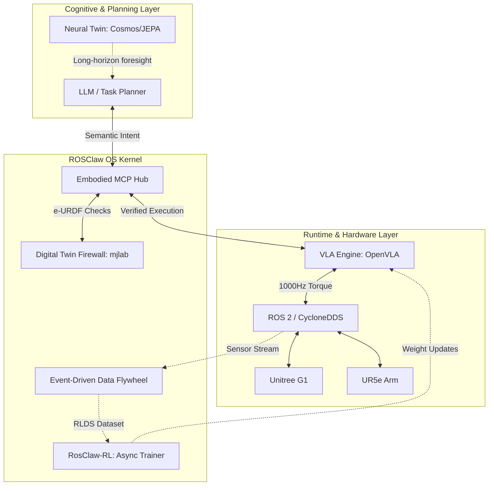

<div align="center">

# 🦾 ROSClaw

**The Universal Operating System for Software-Defined Embodied AI.**

[](https://opensource.org/licenses/Apache-2.0)
[](https://docs.ros.org/)
[-black?logo=mujoco)](https://mujoco.org/)

[English](README.md) • [中文文档](https://docs.rosclaw.io/zh) • [Architecture](#-architecture) • [Quick Start](#-quick-start) • [Discord](https://discord.com/invite/E6nPCDu6KJ)

<br/>

> *"Write Once, Embody Anywhere. Train any robot simply by talking."*

</div>

<br/>

## 🌍 The Vision

While large foundation models have demonstrated unprecedented cognitive reasoning for embodied tasks, their real-world deployment is severely bottlenecked. The industry lacks a unified operating system that can safely and asynchronously bridge low-frequency semantic intents (LLMs) with high-frequency physical execution (Robotics).

**ROSClaw is the "AUTOSAR + Android" for the robotics industry.** It breaks down hardware silos by providing a standardized OS layer that unifies heterogeneous embodiments (humanoids, quadrupeds, robotic arms), Vision-Language-Action (VLA) policies, and autonomous data flywheels.

---

## ✨ Core Innovations

ROSClaw is not just a middleware; it is a paradigm shift built on four foundational pillars:

### 1. 🧠 Asynchronous Brain-Cerebellum Routing
Decouples the **Cognitive Brain** (LLMs running at ~1Hz via MCP) from the **Physical Cerebellum** (ROS 2 controllers/VLA running at 1000Hz). This ensures that network latency or LLM generation delays never compromise physical stability.

### 2. 🛡️ Semantic-Physical Firewall (e-URDF + MuJoCo)
LLM hallucinations in the physical world are catastrophic. ROSClaw introduces `e-URDF`—an Embodied URDF sandbox. Before any risky command reaches the real robot, it is fast-forwarded in a **Headless Digital Twin (powered by mjlab/MuJoCo)**. If the simulation predicts a collision or torque overload, the action is blocked, and the LLM is prompted to self-correct.

### 3. 🤝 Embodied Multi-Agent Federation
Robots shouldn't act alone. ROSClaw natively supports the **Reflex Handshake Protocol** via DDS, allowing seamless, millisecond-level collaboration between heterogeneous robots (e.g., a Unitree G1 handing over an object to a UR5e).

### 4. 🔄 RosClaw-RL & The Data Flywheel
**Train any robot simply by talking.** Every successful action and Auto-EAP recovery attempt is intercepted by an Event-Driven Ring Buffer. Data is automatically time-synced and packaged into Hugging Face `LeRobot` formats (RLDS/HDF5) to continuously fine-tune underlying VLA models.

---

## 🏗 System Architecture

ROSClaw elegantly abstracts the complexity of modern robotics into a unified 7-layer stack:



---

## 🚀 Quick Start

### Installation

Install the production-ready ROSClaw framework:

```bash
# Clone repository
git clone https://github.com/ros-claw/rosclaw.git
cd rosclaw

# Install with ROS 2 support (for real robot control)
pip install -e ".[ros2,dev]"

# Or minimal installation (Digital Twin only)
pip install -e "."
```

### Dependencies

- Python 3.10+
- NumPy >= 1.24.0
- MuJoCo >= 3.0.0
- MCP >= 1.0.0
- ROS 2 (optional, for real robot control)

### Run Integration Tests

```bash
# Test Digital Twin firewall
python scripts/integration_test.py

# Start MCP Server
rosclaw-ur5-mcp
```

### OpenClaw Integration

ROSClaw connects to OpenClaw via the mcporter bridge:

```typescript
// OpenClaw agent configuration
{
  mcpServers: {
    "rosclaw-ur5": {
      command: "rosclaw-ur5-mcp",
      env: {
        ROBOT_IP: "192.168.1.100",
        DIGITAL_TWIN_ENABLED: "true"
      }
    }
  }
}
```

See [docs/OPENCLAW_INTEGRATION.md](docs/OPENCLAW_INTEGRATION.md) for complete guide.

---

## 📁 Repository Structure

```text
rosclaw/
├── src/rosclaw/
│   ├── __init__.py           # Package exports
│   ├── firewall/
│   │   ├── __init__.py
│   │   └── decorator.py      # DigitalTwinFirewall with real MuJoCo physics
│   ├── mcp/
│   │   ├── __init__.py
│   │   └── ur5_server.py     # UR5 MCP Server (rclpy, real ROS 2)
│   └── specs/
│       └── ur5e.xml          # MuJoCo MJCF model
├── docs/
│   └── OPENCLAW_INTEGRATION.md  # Integration guide
├── scripts/
│   └── integration_test.py   # Test suite
├── pyproject.toml            # Package configuration
└── README.md                 # This file
```

## 🔧 Phase 1: Production-Ready Layers 1-4

ROSClaw Phase 1 is complete with **NO MOCK CODE**:

| Layer | Component | Status |
|-------|-----------|--------|
| L1 | ROS 2 Runtime (`rclpy`) | ✅ Real Subscribers, Publishers, ActionClients |
| L2 | Semantic-HAL | ✅ Fast/Slow lane abstraction |
| L3 | Digital Twin (MuJoCo) | ✅ Real physics validation |
| L4 | Embodiment MCP | ✅ UR5 MCP Server |

---

## 🛡️ Safety Architecture

### Digital Twin Firewall

Every motion is validated in MuJoCo before physical execution:

```python
from rosclaw.firewall import DigitalTwinFirewall, mujoco_firewall, SafetyLevel

# Method 1: Direct validation
firewall = DigitalTwinFirewall("src/rosclaw/specs/ur5e.xml")
result = firewall.validate_trajectory(trajectory_points)
if not result.is_valid:
    raise SafetyViolationError(f"Unsafe: {result.violations}")

# Method 2: Decorator
@mujoco_firewall(model_path="ur5e.xml", safety_level=SafetyLevel.STRICT)
def execute_motion(trajectory):
    # Only runs if validation passes
    ...
```

### Validation Checks

- **Collision Detection**: Self-collision and environment collision
- **Joint Limits**: Position, velocity, and torque limits
- **Workspace**: TCP position within safe bounds
- **Smoothness**: Jerk and acceleration limits

---

## 💎 Supported Embodiments & Ecosystem

ROSClaw is designed to be hardware-agnostic. Official south-bound MCP drivers currently include:
*   **Unitree G1** (via `rosclaw-g1-dds-mcp`)
*   **Universal Robots (UR5e)** (via `rosclaw-ur-ros2-mcp`)
*   **General PTZ Gimbals** (via `rosclaw-gimbal-mcp`)

*Want to add your robot? Check out our [e-URDF Auto-Compiler Guide](docs/e-URDF.md).*

---

## 🙏 Acknowledgements

ROSClaw stands on the shoulders of giants. We deeply acknowledge the following projects that shaped our architecture:
*   **[OpenClaw](https://github.com/openclaw/openclaw)**: For the groundbreaking digital Agent framework and MCP integration.
*   **[RoboClaw](https://github.com/MINT-SJTU/RoboClaw)**: For pioneering the Embodied closed-loop and Entangled Action Pairs (EAP).
*   **[mjlab](https://github.com/mujocolab/mjlab)**: For providing the blazingly fast MuJoCo backend that powers our Digital Twin Firewall.
*   **[OpenClaw-RL](https://github.com/openclaw/openclaw-rl)**: For the asynchronous reinforcement learning paradigm that enables our "Talk to Train" vision.

---

<div align="center">
  <b>Defined by the Open Source Community. Built for the Physical World.</b><br>
  <a href="https://rosclaw.io">rosclaw.io</a>
</div>
