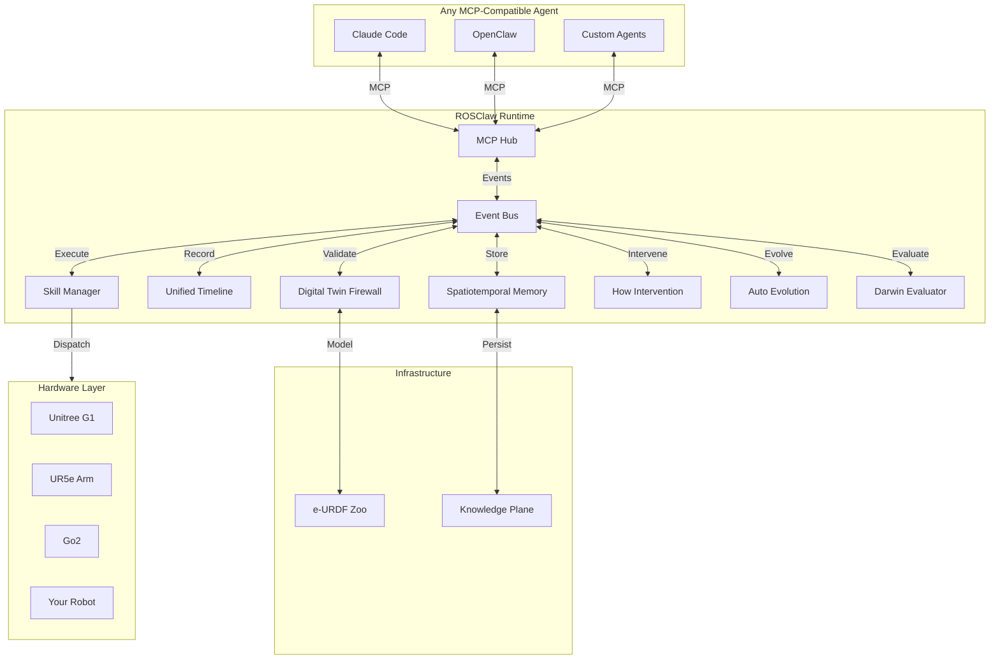

<div align="center">

# ROSClaw

### Self-Evolving Runtime Infrastructure for Physical AI & Embodied Agents

**Ground AI agents into robot bodies. Validate every action. Learn from every trace. Evolve every skill.**

[](LICENSE)
[](https://www.python.org/)
[](https://docs.ros.org/)
[](https://mujoco.org/)
[](https://modelcontextprotocol.io/)
[](https://github.com/ros-claw/rosclaw/releases)

[Website](https://rosclaw.io) • [Quick Start](QUICKSTART.md) • [Architecture](ARCHITECTURE.md) • [Docs](docs/) • [Contact](mailto:ai@rosclaw.io)

<br/>

```bash
curl -sSL https://rosclaw.io/get | bash
rosclaw firstboot
```

</div>

---

## What is ROSClaw?

ROSClaw is **not** another chatbot framework. It is **not** a thin LLM-to-ROS wrapper. It is **not** a collection of unrelated robotics scripts.

ROSClaw is a **runtime infrastructure layer for Physical AI**: it connects AI agents, robot embodiments, simulation sandboxes, capability providers, physical memory, and self-evolution loops into one coherent operating layer. It is designed for embodied agents that must reason, act safely, remember what happened, recover from failure, and improve over time.

```
┌──────────────────────────────────────────────────────────────┐
│           External Cognitive Brains                          │
│     Claude / GPT / Qwen / OpenClaw / Custom Agents           │
└───────────────────────────┬──────────────────────────────────┘
                            │ MCP / SDK / AgentContext
                            ▼
┌──────────────────────────────────────────────────────────────┐
│           ROSClaw Runtime                                    │
│  AgentContext │ TaskContext │ SkillContext │ Trace           │
└───────────────────────────┬──────────────────────────────────┘
                            │
        ┌───────────────────┼───────────────────┐
        ▼                   ▼                   ▼
┌───────────────┐   ┌───────────────┐   ┌───────────────┐
│   Provider    │   │   Sandbox     │   │    Darwin     │
│  Capability   │   │  e-URDF /     │   │  Benchmark /  │
│   Router      │   │  MuJoCo /     │   │  Regression / │
│               │   │  Firewall     │   │  Evaluation   │
└───────┬───────┘   └───────┬───────┘   └───────────────┘
        │                   │
        └───────────┬───────┘
                    ▼
┌──────────────────────────────────────────────────────────────┐
│           Physical World / Simulator                         │
│        UR5e / G1 / Go2 / RealSense / IoT / MuJoCo            │
└───────────────────────────┬──────────────────────────────────┘
                            │
                            ▼
┌──────────────────────────────────────────────────────────────┐
│           Practice Capture                                   │
│   Unified Timeline / MCAP / JSONL / Video / Events           │
└───────────────────────────┬──────────────────────────────────┘
                            │
                            ▼
┌──────────────────────────────────────────────────────────────┐
│           Knowledge Plane                                    │
│  Robot │ Skill │ Provider │ Episode │ Failure │ Evidence    │
└───────────────┬────────────────────────────┬─────────────────┘
                │                            │
                ▼                            ▼
┌───────────────────────┐      ┌───────────────────────────────┐
│     Memory            │      │         Know                  │
│  Spatiotemporal       │      │  Physical-AI Knowledge        │
│  Failure / Success    │      │  Compiler                     │
│  Pattern / Causal     │      │  TaskCard / Pattern / Evidence│
└───────────┬───────────┘      └───────────────┬───────────────┘
            │                                  │
            └──────────────┬───────────────────┘
                           │
                           ▼
            ┌──────────────────────────────┐
            │      How  ←→  Auto           │
            │  Runtime Intervention        │
            │  Self-Evolution Control      │
            │  Proposal / Patch / Champion │
            └──────────────┬───────────────┘
                           │
                           ▼
                 ┌─────────────────┐
                 │  Skill Registry │
                 │  Versioned /    │
                 │  Champion /     │
                 │  Rollback-safe  │
                 └─────────────────┘
```

---

## Why Physical AI Needs Runtime Infrastructure

Large language models can plan, write code, and reason over symbols. But physical intelligence requires more than tokens.

A physical agent must know:

- What body it has;
- What sensors and actuators it owns;
- What actions are safe;
- What happened during execution;
- Why a skill failed;
- How to recover;
- How to improve the skill without breaking safety.

Physical worlds have gravity, friction, collision, latency, sensor noise, torque limits, joint limits, and safety boundaries. ROSClaw provides the missing infrastructure between high-level AI agents and the physical world.

---

## The ROSClaw Closed Loop

> **Every physical action should be grounded, validated, recorded, remembered, and improved.**

```
Physical Task
    ↓
Agent Intent
    ↓
Capability Provider
    ↓
Sandbox / Firewall Validation
    ↓
Runtime Execution
    ↓
Practice Capture
    ↓
Spatiotemporal Memory
    ↓
Runtime Intervention (How)
    ↓
Knowledge Compilation (Know)
    ↓
Auto Evolution
    ↓
Champion Skill
    ↓
Safer Physical Task
```

Auto may propose changes, but it cannot approve them alone. Sandbox validation, Darwin evaluation, the promotion gate, and human approval together decide whether a change reaches the real world.

---

## Quick Start

Install the CLI and run the interactive first-boot wizard:

```bash
curl -sSL https://rosclaw.io/get | bash
rosclaw firstboot
rosclaw doctor
rosclaw status
```

Run a local simulation demo without any hardware:

```bash
rosclaw sandbox run --robot sim_ur5e --world tabletop --task reach
```

For headless or CI environments:

```bash
rosclaw firstboot --yes --profile offline --no-telemetry
```

See [QUICKSTART.md](QUICKSTART.md) for four guided paths: local simulation, agent integration, robot body setup, and developer setup.

---

## First Boot Flow

`rosclaw firstboot` turns the bootstrap install into a working local runtime:

1. Detects platform and Python version.
2. Creates the workspace skeleton at `~/.rosclaw`.
3. Writes `rosclaw.yaml` with chosen profile.
4. Generates `mcp.json` if MCP is enabled.
5. Creates telemetry preferences (default disabled).
6. Records install metadata in `state/install.json`.
7. Runs `rosclaw doctor --bootstrap`.
8. Prints next-step instructions.
9. Leaves the system read-only and robot-safe until you opt in.

Read [docs/FIRSTBOOT.md](docs/FIRSTBOOT.md) for the complete guide.

---

## Developer Install

To hack on ROSClaw itself:

```bash
git clone https://github.com/ros-claw/rosclaw.git
cd rosclaw
make setup
PYTHONPATH=src pytest tests -q
```

`make setup` creates a local venv, installs the package in editable mode, and runs `rosclaw firstboot` in dev mode.

---

## CLI Map

| Goal | Command | Status |
|------|---------|--------|
| Install CLI | `curl -sSL https://rosclaw.io/get \| bash` | Stable |
| First boot | `rosclaw firstboot` | Stable |
| Health check | `rosclaw doctor` | Stable |
| List robots | `rosclaw robot list` | Stable |
| Run simulation | `rosclaw sandbox run --robot sim_ur5e ...` | Stable |
| Configure agent | `rosclaw agent init claude-code` | Stable |
| Start MCP server | `rosclaw mcp serve` | Stable |
| Validate hub asset | `rosclaw hub validate <manifest.yaml>` | Stable |
| Search hub | `rosclaw hub search <term>` | Stable |
| Install hub asset | `rosclaw hub install <uri>` | Stable |
| List installed assets | `rosclaw hub list --installed` | Stable |
| Uninstall hub asset | `rosclaw hub uninstall <uri>` | Stable |
| Initialize provider | `rosclaw provider init` | Planned |
| Route capability | `rosclaw provider route --capability <name>` | Planned |
| Start practice | `rosclaw practice start --sources <sources>` | Planned |
| Advise on failure | `rosclaw how advise --task <id> --failure <id>` | Planned |
| Run auto suite | `rosclaw auto run --suite <suite>` | Planned |
| Evaluate with Darwin | `rosclaw darwin eval --skill <id>` | Research |

See [docs/CLI.md](docs/CLI.md) for the full command reference with status labels.

---

## Core Runtime Modules

| Module | Responsibility |
|--------|----------------|
| **Runtime** | Lifecycle, config, plugin registration, dependency injection. |
| **EventBus** | Module communication, topic routing, trace correlation. |
| **Provider** | Capability routing, schema enforcement, safety boundary. |
| **Sandbox** | Safety validation, firewall, MuJoCo pre-play. |
| **Practice** | Timeline, MCAP, JSONL, execution records. |
| **Memory** | Experience graph, failure/success patterns, recall. |
| **Know** | TaskCard, Pattern, EvidenceTrace, failure taxonomy. |
| **How** | Runtime intervention, injection_id, evidence. |
| **Auto** | Proposal, patch, experiment, champion, dead-end tracking. |
| **Darwin** | Multi-seed benchmark, stress scenario, regression. |
| **Skill Registry** | Version, lineage, champion, rollback. |
| **Dashboard** | Observability, evolution trace, lineage visualization. |

---

## Hub & Assets

The ROSClaw Hub is a **Physical-AI Asset Hub** for skills, providers, hardware MCP servers, digital twins, and cognitive wikis. Assets can be kept entirely local or synced with a registry.

Supported asset types:

- `skill` — reusable physical-AI skill
- `provider` — runtime capability provider
- `hardware_mcp` — MCP server that wraps real hardware
- `digital_twin` — simulation asset / e-URDF twin
- `cognitive_wiki` — structured operational knowledge

Validate a local asset, search the hub, and publish your own:

```bash
rosclaw hub validate tests/fixtures/hub_assets/hardware_mcp_valid/manifest.yaml
rosclaw hub search g1
rosclaw hub publish --dry-run
```

See [docs/ASSETS.md](docs/ASSETS.md) and [docs/hub/README.md](docs/hub/README.md).

---

## Example Workflow: Desktop Pick-and-Place

A complete closed-loop example:

```
Agent: "Pick the red cube from the table and place it in the bin."
  ↓
Provider selects the pick-and-place skill for the current body.
  ↓
Sandbox validates the trajectory against the e-URDF and safety limits.
  ↓
Runtime dispatches the validated trajectory.
  ↓
Practice records the episode: video, state, events, outcome.
  ↓
Memory indexes the experience for similar future tasks.
  ↓
How intervenes if the grasp fails and requests a retry pattern.
  ↓
Know compiles a TaskCard: "red cube, glossy surface, parallel jaw grip."
  ↓
Auto proposes a grip-force patch.
  ↓
Darwin evaluates the patch across 100 simulated seeds.
  ↓
Promotion gate moves the patch to champion if it improves success rate.
```

---

## Safety Model

ROSClaw's core safety rule:

> **No model output should directly control a robot.**

Every physical action passes through a validation pipeline:

1. Provider produces a structured action proposal.
2. Sandbox / Firewall checks it against the effective body model and safety policy.
3. The decision is one of `ALLOW`, `MODIFY`, `BLOCK`, or `REQUIRE_HUMAN_CONFIRMATION`.
4. Execution is recorded by Practice.
5. Memory and Know retain evidence for later audit.
6. How and Auto may propose improvements, but only the promotion gate can change the active skill.

ROSClaw is research infrastructure. It does not replace certified industrial safety systems. Always test in simulation first, keep emergency stops engaged, and use human supervision.

Read [docs/SAFETY.md](docs/SAFETY.md) for the full safety model.

---

## Architecture



Read [ARCHITECTURE.md](ARCHITECTURE.md) for the 14 Engineering Iron Rules and detailed module boundaries.

---

## Supported Integrations

| Category | Technologies |
|----------|--------------|
| **Agents** | Claude Code, OpenClaw, any MCP-compatible client |
| **Simulation** | MuJoCo, Isaac Sim |
| **Robots** | Unitree G1 / Go2, UR5e, TurtleBot3, custom e-URDF |
| **ROS** | ROS 2 Humble / Jazzy via MCP drivers |
| **Models** | OpenAI, DeepSeek, Qwen, local providers via capability routing |
| **Memory** | SeekDB / local experience graph |

---

## Documentation

- [QUICKSTART.md](QUICKSTART.md) — 5-minute quick start.
- [INSTALL.md](INSTALL.md) — Detailed installation and troubleshooting.
- [docs/FIRSTBOOT.md](docs/FIRSTBOOT.md) — Bootstrap and first boot reference.
- [docs/CLI.md](docs/CLI.md) — CLI command reference.
- [docs/SAFETY.md](docs/SAFETY.md) — Safety model and deployment rules.
- [docs/ASSETS.md](docs/ASSETS.md) — Physical-AI Asset Hub.
- [docs/hub/README.md](docs/hub/README.md) — Hub workflows.
- [ARCHITECTURE.md](ARCHITECTURE.md) — Runtime architecture.
- [CONTRIBUTING.md](CONTRIBUTING.md) — Development standards.

---

## Roadmap

| Phase | Focus |
|-------|-------|
| **Current (v1.0)** | Runtime, EventBus, Sandbox, Practice, Memory, How, MCP server, first boot, Hub validation/search. |
| **In Progress** | Provider routing, skill execution on real bodies, auto evolution workflow, Darwin evaluation. |
| **Research** | Multi-agent fleet coordination, continuous self-evolution in production, cross-robot skill transfer. |

---

## Contributing

We welcome contributions. See [CONTRIBUTING.md](CONTRIBUTING.md) for standards, PR process, and code style.

---

## Contact

Questions, partnerships, and security reports:

- Email: [ai@rosclaw.io](mailto:ai@rosclaw.io)
- Issues: [GitHub Issues](https://github.com/ros-claw/rosclaw/issues)
- Discussions: [GitHub Discussions](https://github.com/ros-claw/rosclaw/discussions)

---

## License

[MIT](LICENSE)
