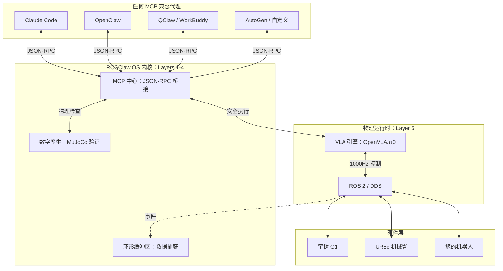
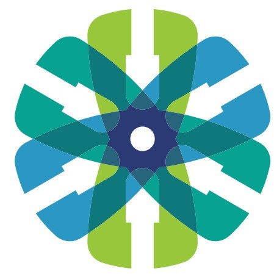

<div align="center">

# 🦾 ROSClaw

**连接多模态 AI 代理与物理世界的通用操作系统。**

[](https://opensource.org/licenses/Apache-2.0)
[](https://docs.ros.org/)
[](https://mujoco.org/)
[](https://modelcontextprotocol.io/)
[](https://arxiv.org/pdf/2604.04664)

[English](./README.md) • **中文** • [架构](#-架构) • [快速开始](#-快速开始) • [Discord](https://discord.com/invite/E6nPCDu6KJ)

<br/>

> *"教导一次，任意实体运行。共享技能，重塑现实。"*

</div>

<br/>

## 🌍 愿景：普及物理 AI

像 **Claude Code、OpenClaw 和 WorkBuddy** 这样的出色框架已经实现了数字世界的民主化——让任何人都能轻松编排 AI 团队来构建软件。

**ROSClaw 将这场革命带到物理世界。**

我们不仅仅是在构建 LLM 与机器人之间的桥梁；我们正在构建一个**物理技能的开放生态系统**。如果东京的开发者通过 ROSClaw 教机械臂"精密拧螺丝"技能，柏林的工厂工人可以立即下载该技能并在完全不同的人形机器人上部署——**无需重新编程**。

通过通用模型上下文协议 (MCP) 统一异构硬件，并通过我们的操作系统内核对物理进行抽象，我们使创作者能够**在数千个行业中共享、迭代和部署具身 AI**。

> **我们想象的未来**：一个物理智能像软件一样自由流动的技能市场——教导一次，任意实体运行。

---

## ✨ 核心创新

ROSClaw 是一个基于四大支柱构建的**代理无关具身操作系统**：

### 1. 🌐 通用 MCP 中心

即插即用于**任何** AI 代理框架。我们将复杂的 ROS 2 主题和 DDS 流转换为 Claude Code、OpenClaw 或任何 MCP 兼容代理可以原生命令的清晰 JSON 模式。

### 2. 🧠 异步脑-小脑路由

将**认知脑** (~1Hz 的 LLM) 与**物理小脑** (1000Hz 的 ROS 2/VLA) 解耦。网络延迟或 LLM 延迟永远不会影响物理稳定性。

### 3. 🛡️ 数字孪生防火墙 (MuJoCo)

LLM 在物理世界中的幻觉是灾难性的。在任何命令执行之前，它会在**无头数字孪生 (MuJoCo)** 中快速转发。如果预测到碰撞或扭矩过载，动作将被阻止，代理会自我纠正。

### 4. 🔄 技能飞轮 (TODO)

每次执行都会馈送到事件驱动的环形缓冲区。数据被打包成 `LeRobot` 格式以持续微调 VLA 模型。**对话即训练**——每天进化机器人的物理直觉。

---

## 🗺️ 架构：设计为代理无关



**关键洞察**：Layers 1-4 形成稳定内核。任何代理 (Layer 6+) 都可以通过 MCP 连接，无需特定硬件知识。

---

## 🚀 快速开始

零配置。原生兼容性。30 秒内让您的机器人上线。

### 1. 安装 ROSClaw OS 内核

```bash
curl -sSL https://rosclaw.io/get | bash
```

### 2. 接入任何代理框架

**Claude Code：**
```bash
claude mcp add rosclaw -- rosclaw-hub --auto-discover
# 然后："Claude，将 UR5 机械臂移动到原位并先验证"
```

**OpenClaw / WorkBuddy (mcp_servers.json)：**
```json
{
  "mcpServers": {
    "rosclaw-embodiment": {
      "command": "rosclaw-hub",
      "args": ["--enable-digital-twin"]
    }
  }
}
```

---

## 🎯 路线图：我们要去哪里

| 阶段 | 状态 | 关键交付物 |
|-------|--------|------------------|
| **1** | ✅ | 数字孪生防火墙、UR5 MCP 服务器、MuJoCo 模型 |
| **1.5** | 🚧 | 测试 (42 个测试)、CI/CD、PyPI 发布 |
| **2** | 📋 | 数据飞轮、OpenVLA/π0 集成、技能库 |
| **3** | 📋 | 通过 sdk_to_mcp 支持 G1/Panda、ClawHub 技能市场 |
| **4** | 🔮 | 神经孪生、多智能体协作、TSN |

### 活跃 TODO
- [ ] 将 print 替换为 logging 模块
- [ ] 模型路径的 YAML 配置
- [ ] PyPI 发布 v0.1.0
- [ ] sdk_to_mcp 集成文档

---

## 💎 支持的具身形态与生态系统

我们正在通过官方南向驱动程序积极统一所有硬件：

*   **宇树 G1** (通过 `rosclaw-g1-dds-mcp`)
*   **优傲机器人 (UR5e)** (通过 `rosclaw-ur-ros2-mcp`)
*   **通用 PTZ 云台** (通过 `rosclaw-gimbal-mcp`)

### 🚀 sdk_to_mcp：零代码硬件集成

有新的机器人 SDK？我们的 **[sdk_to_mcp](https://github.com/ros-claw/sdk_to_mcp)** 工具链从官方 SDK 文档自动生成 MCP 服务器——**无需手动驱动程序开发**。

```bash
# 示例：从机器人 SDK 文档生成 MCP 服务器
python -m sdk_to_mcp generate --sdk-doc robot_sdk.pdf --output rosclaw-newrobot-mcp
```

---

## 🛡️ 安全架构

### 数字孪生防火墙

每次运动在物理执行之前都会在 MuJoCo 中验证：

```python
from rosclaw.firewall import DigitalTwinFirewall, mujoco_firewall, SafetyLevel

# 方法 1：直接验证
firewall = DigitalTwinFirewall("src/rosclaw/specs/ur5e.xml")
result = firewall.validate_trajectory(trajectory_points)
if not result.is_safe:
    raise SafetyViolationError(f"不安全: {result.violation_details}")

# 方法 2：装饰器
@mujoco_firewall(model_path="ur5e.xml", safety_level=SafetyLevel.STRICT)
def execute_motion(trajectory):
    # 仅在验证通过时运行
    ...
```

### 验证检查

- **碰撞检测**：自碰撞和环境碰撞
- **关节限制**：位置、速度和扭矩限制
- **工作空间**：TCP 位置在安全范围内
- **平滑度**：加速度和加加速度限制

---

## 🙏 致谢

ROSClaw 站在巨人的肩膀上：

### 学术合作单位

<div align="center">
  <table>
    <tr>
      <td align="center" width="50%">
        <a href="https://www.tongji.edu.cn/">
          
        </a>
        <br/>
        <b><a href="https://www.tongji.edu.cn/">同济大学</a></b>
      </td>
      <td align="center" width="50%">
        <a href="https://srias.tongji.edu.cn/">
          
        </a>
        <br/>
        <b><a href="https://srias.tongji.edu.cn/">上海自主智能无人系统科学中心</a></b>
      </td>
    </tr>
  </table>
</div>

本项目由**同济大学**和**上海自主智能无人系统科学中心** proudly 支持。他们对推进自主智能系统研究的承诺为 ROSClaw 等创新提供了基础。

### 开源社区
*   **代理生态系统 (OpenClaw、Claude Code 等)**：开创了启发我们物理架构的数字工作流程。
*   **[RoboClaw](https://github.com/MINT-SJTU/RoboClaw)**：开创了具身闭环和纠缠动作对 (EAP)。
*   **[mjlab](https://github.com/mujocolab/mjlab)**：提供了驱动我们数字孪生防火墙的超快速 MuJoCo 后端。

---

<div align="center">
  <b>将 AGI 连接到物理宇宙。</b><br>
  <a href="https://rosclaw.io">rosclaw.io</a>
</div>
