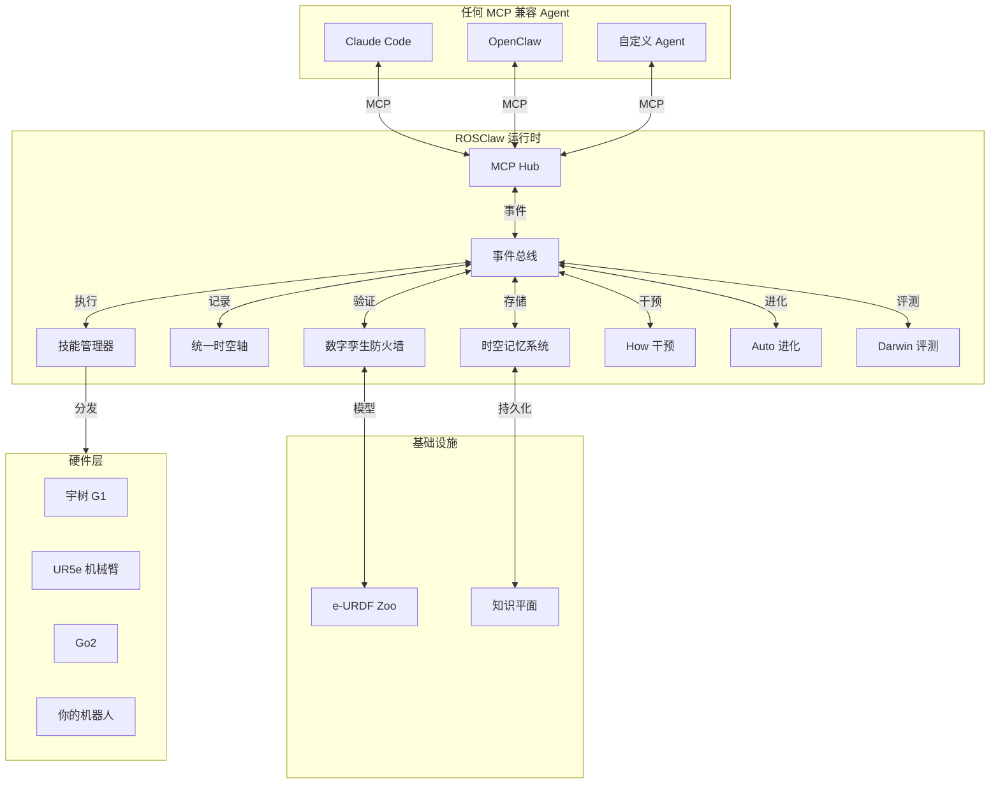

<div align="center">

# ROSClaw

### 面向物理 AI 与具身 Agent 的自进化运行时基础设施

**让 AI Agent 进入机器人身体，让每一次物理行动都可验证、可记忆、可修复、可进化。**

[](LICENSE)
[](https://www.python.org/)
[](https://docs.ros.org/)
[](https://mujoco.org/)
[](https://modelcontextprotocol.io/)
[](https://github.com/ros-claw/rosclaw/releases)

[English](README.md) • **中文** • [架构](ARCHITECTURE.md) • [快速开始](QUICKSTART.md) • [文档](docs/)

<br/>

```bash
curl -sSL https://rosclaw.io/get | bash
rosclaw firstboot
```

</div>

---

## ROSClaw 是什么？

ROSClaw **不是**另一个聊天机器人框架，**不是**简单的"大模型调用 ROS"工具，**不是**一堆零散的机器人脚本集合。

ROSClaw 是一套**面向物理 AI 的运行时基础设施层**：它把 AI Agent、机器人本体、仿真沙盒、能力 Provider、物理记忆和自进化闭环连接到一起，形成统一的运行时层。它是为下一代具身智能体设计的——这些智能体不仅要会推理，还要能**安全行动、记住经验、失败恢复、持续进化**。

---

## 为什么物理 AI 需要运行时基础设施？

今天的大模型已经很会推理、写代码、规划任务，但它们本质上还活在"文字和 Token 世界"里。

如果让一个大模型直接控制机器人，会遇到很多问题：

- 它不知道机器人身体的真实限制；
- 它不知道机械臂能转多少度；
- 它不知道某个动作会不会撞到桌子；
- 它不知道上一次抓取为什么失败；
- 它不知道失败之后该如何恢复；
- 它也不知道如何把失败经验变成新的技能。

**物理世界不是聊天窗口。**物理世界有重力、摩擦、碰撞、延迟、传感噪声、力矩限制、关节限制和安全边界。ROSClaw 要做的，就是把大模型的"认知能力"真正接到物理世界中。

---

## ROSClaw 的闭环

> **每一次物理行动，都应该被约束、被验证、被记录、被记住，并最终变成更好的技能。**

```
物理任务
    ↓
Agent 意图
    ↓
能力 Provider
    ↓
沙盒 / 防火墙验证
    ↓
真实执行
    ↓
实践数据捕获
    ↓
时空记忆沉淀
    ↓
运行时干预 (How)
    ↓
知识编译 (Know)
    ↓
自动进化 (Auto)
    ↓
Champion Skill
    ↓
更安全、更可靠的下一次执行
```

Auto 可以提出改变，但不能独自批准改变。沙盒验证、Darwin 评测、晋升门和人类确认共同决定改变是否能进入真实世界。

---

## 快速开始

安装 CLI 并运行交互式首次启动向导：

```bash
curl -sSL https://rosclaw.io/get | bash
rosclaw firstboot
rosclaw doctor
rosclaw status
```

无需硬件即可运行本地仿真演示：

```bash
rosclaw sandbox run --robot sim_ur5e --world tabletop --task reach
```

无头或 CI 环境：

```bash
rosclaw firstboot --yes --profile offline --no-telemetry
```

查看 [QUICKSTART.md](QUICKSTART.md) 获取四条路径的详细指南：本地仿真、Agent 集成、机器人本体设置和开发者设置。

---

## First Boot 流程

`rosclaw firstboot` 会把一次性的安装变成可用的本地运行时：

1. 检测平台与 Python 版本。
2. 在 `~/.rosclaw` 创建工作区骨架。
3. 写入根据所选 profile 生成的 `rosclaw.yaml`。
4. 如果启用 MCP，生成 `mcp.json`。
5. 创建遥测偏好配置（默认关闭）。
6. 在 `state/install.json` 记录安装元数据。
7. 运行 `rosclaw doctor --bootstrap`。
8. 打印下一步操作提示。
9. 在明确选择加入之前，保持只读、不连接真实机器人。

完整说明见 [docs/FIRSTBOOT.md](docs/FIRSTBOOT.md)。

---

## 开发者安装

如果你想修改 ROSClaw 本身：

```bash
git clone https://github.com/ros-claw/rosclaw.git
cd rosclaw
make setup
PYTHONPATH=src pytest tests -q
```

`make setup` 会创建本地 venv、以可编辑模式安装包，并以 dev 模式运行 `rosclaw firstboot`。

---

## CLI 速查表

| 目标 | 命令 | 状态 |
|------|------|------|
| 安装 CLI | `curl -sSL https://rosclaw.io/get \| bash` | Stable |
| 首次启动 | `rosclaw firstboot` | Stable |
| 健康检查 | `rosclaw doctor` | Stable |
| 列出机器人 | `rosclaw robot list` | Stable |
| 运行仿真 | `rosclaw sandbox run --robot sim_ur5e ...` | Stable |
| 配置 Agent | `rosclaw agent init claude-code` | Stable |
| 启动 MCP 服务 | `rosclaw mcp serve` | Stable |
| 验证 Hub 资产 | `rosclaw hub validate <manifest.yaml>` | Stable |
| 搜索 Hub | `rosclaw hub search <term>` | Stable |
| 安装 Hub 资产 | `rosclaw hub install <uri>` | Stable |
| 列出已安装资产 | `rosclaw hub list --installed` | Stable |
| 卸载 Hub 资产 | `rosclaw hub uninstall <uri>` | Stable |
| 初始化 Provider | `rosclaw provider init` | Planned |
| 路由能力 | `rosclaw provider route --capability <name>` | Planned |
| 开始 Practice | `rosclaw practice start --sources <sources>` | Planned |
| 故障建议 | `rosclaw how advise --task <id> --failure <id>` | Planned |
| 运行 Auto 套件 | `rosclaw auto run --suite <suite>` | Planned |
| Darwin 评测 | `rosclaw darwin eval --skill <id>` | Research |

完整命令参考见 [docs/CLI.md](docs/CLI.md)。

---

## 核心运行时模块

| 模块 | 职责 |
|------|------|
| **Runtime** | 生命周期、配置、插件注册、依赖注入。 |
| **EventBus** | 模块通信、主题路由、Trace 关联。 |
| **Provider** | 能力路由、Schema 约束、安全边界。 |
| **Sandbox** | 安全验证、防火墙、MuJoCo 预演。 |
| **Practice** | 时间线、MCAP、JSONL、执行记录。 |
| **Memory** | 经验图谱、失败/成功模式、召回。 |
| **Know** | TaskCard、Pattern、EvidenceTrace、故障分类。 |
| **How** | 运行时干预、injection_id、证据。 |
| **Auto** | 提案、补丁、实验、Champion、DeadEnd 跟踪。 |
| **Darwin** | 多种子基准测试、压力场景、回归。 |
| **Skill Registry** | 版本、血缘、Champion、回滚。 |
| **Dashboard** | 可观测性、进化轨迹、血缘可视化。 |

---

## Hub 与资产

ROSClaw Hub 是一个**物理 AI 资产中心**，用于管理技能、Provider、硬件 MCP 服务器、数字孪生和认知 Wiki。资产可以完全本地化，也可以与注册表同步。

支持的资产类型：

- `skill` — 可复用的物理 AI 技能
- `provider` — 运行时能力 Provider
- `hardware_mcp` — 封装真实硬件的 MCP 服务器
- `digital_twin` — 仿真资产 / e-URDF 孪生
- `cognitive_wiki` — 结构化运维知识

验证本地资产、搜索 Hub、发布资产：

```bash
rosclaw hub validate tests/fixtures/hub_assets/hardware_mcp_valid/manifest.yaml
rosclaw hub search g1
rosclaw hub publish --dry-run
```

详见 [docs/ASSETS.md](docs/ASSETS.md) 和 [docs/hub/README.md](docs/hub/README.md)。

---

## 示例工作流：桌面抓取

一个完整的闭环示例：

```
Agent: "把桌上的红色方块捡起来放到盒子里。"
  ↓
Provider 为当前本体选择抓取技能。
  ↓
Sandbox 根据 e-URDF 和安全限制验证轨迹。
  ↓
Runtime 分发通过验证的轨迹。
  ↓
Practice 记录 Episode：视频、状态、事件、结果。
  ↓
Memory 索引经验，供未来相似任务调用。
  ↓
How 在抓取失败时介入，请求重试模式。
  ↓
Know 编译 TaskCard："红色方块、光滑表面、平行夹爪"。
  ↓
Auto 提出夹持力补丁。
  ↓
Darwin 在 100 个仿真种子上评测补丁。
  ↓
晋升门将补丁提升为 Champion，前提是成功率提高。
```

---

## 安全模型

ROSClaw 的核心安全规则：

> **任何模型输出都不应该直接控制机器人。**

每一个物理动作都要经过验证流水线：

1. Provider 生成结构化的动作提案。
2. Sandbox / Firewall 根据有效本体模型和安全策略检查。
3. 决策结果为 `ALLOW`、`MODIFY`、`BLOCK` 或 `REQUIRE_HUMAN_CONFIRMATION`。
4. Practice 记录执行过程。
5. Memory 和 Know 保留证据供后续审计。
6. How 和 Auto 可以提出改进，但只有晋升门能改变当前生效的技能。

ROSClaw 是研究基础设施，不能替代经过认证的工业安全系统。务必先在仿真中测试，保持急停系统可用，并在人类监督下运行。

完整安全模型见 [docs/SAFETY.md](docs/SAFETY.md)。

---

## 系统架构



架构的 14 条工程铁律和详细模块边界见 [ARCHITECTURE.md](ARCHITECTURE.md)。

---

## 支持的集成

| 类别 | 技术 |
|------|------|
| **Agent** | Claude Code、OpenClaw、任何 MCP 兼容客户端 |
| **仿真** | MuJoCo、Isaac Sim |
| **机器人** | Unitree G1 / Go2、UR5e、TurtleBot3、自定义 e-URDF |
| **ROS** | ROS 2 Humble / Jazzy，通过 MCP 驱动 |
| **模型** | OpenAI、DeepSeek、Qwen，通过能力路由接入本地/私有模型 |
| **记忆** | SeekDB / 本地经验图谱 |

---

## 文档

- [QUICKSTART.md](QUICKSTART.md) — 5 分钟快速开始。
- [INSTALL.md](INSTALL.md) — 详细安装与故障排查。
- [docs/FIRSTBOOT.md](docs/FIRSTBOOT.md) — 安装与首次启动完整参考。
- [docs/CLI.md](docs/CLI.md) — CLI 命令参考。
- [docs/SAFETY.md](docs/SAFETY.md) — 安全模型与部署规则。
- [docs/ASSETS.md](docs/ASSETS.md) — 物理 AI 资产中心。
- [docs/hub/README.md](docs/hub/README.md) — Hub 工作流。
- [ARCHITECTURE.md](ARCHITECTURE.md) — 运行时架构。
- [CONTRIBUTING.md](CONTRIBUTING.md) — 开发规范。

---

## 路线图

| 阶段 | 重点 |
|------|------|
| **当前 (v1.0)** | Runtime、EventBus、Sandbox、Practice、Memory、How、MCP 服务、first boot、Hub 验证/搜索。 |
| **进行中** | Provider 路由、真实本体上的技能执行、自动进化工作流、Darwin 评测。 |
| **研究** | 多 Agent 集群协作、生产环境持续自进化、跨机器人技能迁移。 |

---

## 贡献

欢迎贡献。开发规范、PR 流程和代码风格见 [CONTRIBUTING.md](CONTRIBUTING.md)。

---

## 联系方式

问题、合作与安全报告：

- 邮箱：[ai@rosclaw.io](mailto:ai@rosclaw.io)
- Issues：[GitHub Issues](https://github.com/ros-claw/rosclaw/issues)
- Discussions：[GitHub Discussions](https://github.com/ros-claw/rosclaw/discussions)

---

## 许可证

[MIT](LICENSE)
