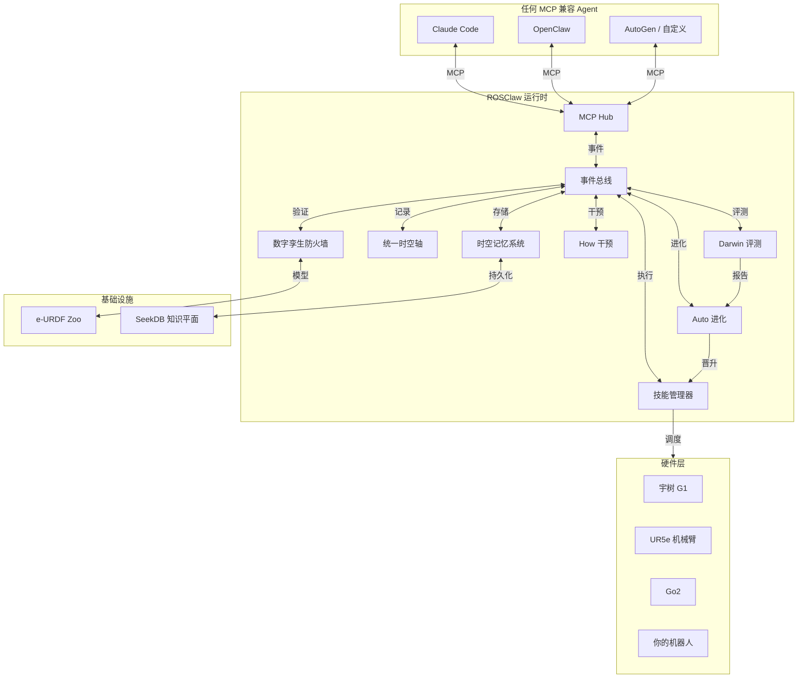

<div align="center">

# ROSClaw

**面向物理 AI 的开放基础设施**

*让 AI Agent 真正进入物理世界。*

[](LICENSE)
[](https://www.python.org/)
[](https://docs.ros.org/)
[](https://mujoco.org/)
[](https://modelcontextprotocol.io/)
[](https://github.com/ros-claw/rosclaw/releases)

[English](README.md) • **中文** • [架构](#架构) • [快速开始](#-快速开始) • [文档](docs/)

<br/>

> **教导一次，任意实体运行。共享技能，持续进化。**

</div>

---

## ROSClaw 是什么？

ROSClaw **不是**另一个聊天机器人框架，**不是**简单的"大模型调用 ROS"工具，**不是**一堆零散的机器人工具集合。

ROSClaw 是一套面向 **物理 AI / 具身智能** 的开放基础设施。它把 AI Agent、机器人本体、仿真沙盒、技能系统、多模态模型、物理记忆和自进化闭环连接到一起，形成统一的运行时层。

它是为下一代具身智能体设计的——这些智能体不仅要会推理，还要能 **安全行动、记住经验、失败恢复、持续进化**。

```
┌──────────────────────────────────────────────────────────────┐
│                    外部认知大脑                              │
│        OpenClaw / Claude / GPT / Qwen / 自定义 Agent          │
└───────────────────────────┬──────────────────────────────────┘
                            │ MCP / SDK / AgentContext
                            ▼
┌──────────────────────────────────────────────────────────────┐
│                    ROSClaw Runtime                           │
│  AgentContext │ TaskContext │ SkillContext │ Trace           │
└───────────────────────────┬──────────────────────────────────┘
                            │
        ┌───────────────────┼───────────────────┐
        ▼                   ▼                   ▼
┌───────────────┐   ┌───────────────┐   ┌───────────────┐
│   Provider    │   │   Sandbox     │   │    Darwin     │
│   能力路由     │   │  e-URDF /     │   │  Benchmark /  │
│               │   │  MuJoCo /     │   │  回归测试 /   │
│               │   │  防火墙       │   │  技能评估     │
└───────┬───────┘   └───────┬───────┘   └───────────────┘
        │                   │
        └───────────┬───────┘
                    ▼
┌──────────────────────────────────────────────────────────────┐
│                    物理世界 / 仿真世界                        │
│             UR5e / G1 / Go2 / RealSense / IoT / MuJoCo       │
└───────────────────────────┬──────────────────────────────────┘
                            │
                            ▼
┌──────────────────────────────────────────────────────────────┐
│                    Practice 实践捕获                          │
│        统一时空轴 / MCAP / JSONL / 视频 / 事件                │
└───────────────────────────┬──────────────────────────────────┘
                            │
                            ▼
┌──────────────────────────────────────────────────────────────┐
│                    SeekDB Knowledge Plane                    │
│  机器人 / 技能 / Provider / Episode / 失败案例 / 证据链        │
└───────────────┬────────────────────────────┬─────────────────┘
                │                            │
                ▼                            ▼
┌───────────────────────┐      ┌───────────────────────────────┐
│       Memory          │      │          Know                 │
│     时空记忆          │      │     物理 AI 知识编译器         │
│  失败 / 成功模式      │      │  TaskCard / Pattern / Evidence│
│  因果图谱             │      │                               │
└───────────┬───────────┘      └───────────────┬───────────────┘
            │                                  │
            └──────────────┬───────────────────┘
                           │
                           ▼
            ┌──────────────────────────────┐
            │      How  ←→  Auto           │
            │     运行时干预                │
            │     自进化控制平面            │
            │  Proposal / Patch / Champion │
            └──────────────┬───────────────┘
                           │
                           ▼
                 ┌─────────────────┐
                 │   Skill Registry│
                 │   版本化 /      │
                 │   Champion /    │
                 │   可回滚        │
                 └─────────────────┘
```

---

## 为什么需要 ROSClaw？

今天的大模型已经很会推理、写代码、规划任务，但它们本质上还活在"文字和 Token 世界"里。

如果让一个大模型直接控制机器人，会遇到很多问题：

- 它不知道机器人身体的真实限制；
- 它不知道机械臂能转多少度；
- 它不知道某个动作会不会撞到桌子；
- 它不知道上一次抓取为什么失败；
- 它不知道失败之后该如何恢复；
- 它也不知道如何把失败经验变成新的技能。

**物理世界不是聊天窗口。**

物理世界有重力、摩擦、碰撞、延迟、传感噪声、力矩限制、关节限制和安全边界。

ROSClaw 要做的，就是把大模型的"认知能力"真正接到物理世界中。

---

## 核心理念

> **每一次物理行动，都应该被约束、被验证、被记录、被记住，并最终变成更好的技能。**

完整闭环：

```
物理任务
    ↓
Agent 意图
    ↓
能力 Provider
    ↓
沙盒 / 防火墙验证
    ↓
真实执行
    ↓
实践数据捕获
    ↓
时空记忆沉淀
    ↓
运行时干预 (How)
    ↓
知识编译 (Know)
    ↓
自动进化 (Auto)
    ↓
Champion Skill
    ↓
更安全、更可靠的下一次执行
```

---

## 系统架构



**关键洞察**：所有模块仅通过事件总线通信，禁止直接模块间调用。这确保了解耦，并使任何 Agent 无需硬件特定知识即可连接。

---

## 核心模块

| 模块 | 作用 |
|------|------|
| `rosclaw-runtime` | ROSClaw 的运行时内核，负责配置、插件、生命周期、健康检查、事件总线和模块编排。 |
| `e-urdf-zoo` | 机器人的"物理基因库"，定义机器人结构、关节、传感器、执行器、安全边界、能力和仿真资产。 |
| `rosclaw-provider` | 具身能力接入层，把 LLM、VLM、VLA、VLN、世界模型、Skill、Critic、Embedding 等统一封装成可调用能力。 |
| `rosclaw-sandbox` | 物理沙盒与安全验证层，负责仿真、预演、回放和动作防火墙。 |
| `rosclaw-practice` | 实践捕获系统，记录机器人执行过程中的传感器、动作、模型决策、工具调用、失败原因和回放数据。 |
| `rosclaw-memory` | 时空记忆系统，沉淀机器人过去经历、失败案例、成功模式、场景记忆和技能经验。 |
| `rosclaw-how` | 运行时干预控制器，当 Agent 卡住、失败、危险或退化时，提供最小必要的恢复建议。 |
| `rosclaw-know` | 物理 AI 知识编译器，把论文、代码、日志、轨迹和失败案例编译成可检索、可验证的工程知识。 |
| `rosclaw-auto` | 自进化控制平面，负责生成改进方案、修改候选技能、组织实验、评估结果、晋升 Champion Skill。 |
| `rosclaw-darwin` | 进化评测竞技场，用于 benchmark、压力测试、技能对比、回归测试和进化速度评估。 |
| `rosclaw-forge` | 具身资产编译器，可以把 SDK、ROS 2 接口、文档和 e-URDF 转换成 MCP Server、Skill、Provider Manifest 等资产。 |
| `rosclaw-dashboard` | 可视化观测平台，用于查看运行状态、任务链路、沙盒回放、记忆、干预、进化过程和技能版本。 |

---

## ROSClaw 有什么不同？

### 1. 不是简单 Tool Calling，而是物理接地

普通 Agent 调工具，很多时候只是调用 API。但机器人不是普通 API。

机器人动作必须考虑：关节限制、力矩限制、工作空间、碰撞风险、速度和加速度、传感器状态、当前环境、人机安全。

ROSClaw 会把大模型的意图先转换成结构化能力请求，再经过安全验证和执行控制。

```
Token 意图 → 能力请求 → 安全验证 → 物理执行
```

### 2. e-URDF：机器人本体是第一等公民

ROSClaw 把机器人本体视为系统最重要的基础资产。一个 e-URDF 不只是传统 URDF，而是包含：

- 机器人结构；
- 关节、连杆、传感器、执行器；
- 安全边界；
- 语义部位；
- 工具坐标系；
- 工作空间；
- 运动能力；
- 仿真模型；
- benchmark 配置。

这让 Agent 不只是知道"我要抓杯子"，还知道"我这具身体能不能安全地抓杯子"。

### 3. 先沙盒，后真实世界

ROSClaw 不鼓励大模型直接控制真实机器人。在真实执行前，动作可以先进入 `rosclaw-sandbox` 做物理预演和安全检查。

可能返回：

```
ALLOW：允许执行
BLOCK：阻止执行
MODIFY：建议修改后执行
REQUIRE_HUMAN_CONFIRMATION：需要人类确认
```

示例：

```json
{
  "decision": "BLOCK",
  "risk_score": 0.92,
  "reason": "预测 wrist_link 会与桌面发生碰撞",
  "violated_constraints": ["collision", "workspace_boundary"],
  "replay_id": "sandbox://replays/firewall_00042"
}
```

### 4. Practice：物理世界的"行车记录仪"

机器人执行失败时，普通系统可能只留下一行日志：

```
grasp failed
```

但 ROSClaw 会记录完整实践过程：Agent 想做什么、Provider 调用了什么能力、Sandbox 是否拦截、Runtime 执行了什么、传感器看到了什么、关节和力矩发生了什么、Critic 判断是否成功、失败发生在哪个阶段、后续是否生成了恢复建议。

这些会被保存为：MCAP、JSONL、视频、replay、failure report、PraxisEvent。

### 5. Memory：机器人记得自己经历过什么

ROSClaw 的 Memory 不只是聊天记录。它是机器人自己的时空记忆系统。它可以回答：

```
刚才为什么抓取失败？
上一次类似失败是怎么解决的？
这个机器人在哪些场景下容易碰撞？
哪个版本的 skill 成功率最高？
某个按钮上次是如何被按下的？
```

### 6. How：Agent 卡住时的运行时反射弧

当 Agent 一直失败、分数不涨、动作危险或陷入无效尝试时，`rosclaw-how` 会提供最小必要的干预。例如：

```
当前失败可能是接近高度过低导致的。
下一次只调整 pre_grasp_height，不要同时修改所有参数。
建议增加 3cm 预抓取高度，并降低接近速度。
预期信号：碰撞率下降，抓取成功率上升。
```

How 不是代替 Agent，而是像"反射弧"一样，在关键时刻给它一点提示。

### 7. Auto：让技能越练越好

`rosclaw-auto` 会把重复失败变成自动改进流程：

```
失败案例
    ↓
诊断
    ↓
假设
    ↓
改进提案
    ↓
技能补丁
    ↓
沙盒实验
    ↓
Darwin 评测
    ↓
Champion 晋升 / DeadEnd 记录
```

ROSClaw 不会直接覆盖原技能，而是做版本管理：

```
pick_cube@v1.0.0  baseline_champion
    ↓
pick_cube@candidate_0001  sandbox_passed
    ↓
pick_cube@v1.1.0  sim_champion
    ↓
pick_cube@v1.1.0  sandbox_champion
    ↓
pick_cube@v1.1.0  real_candidate
    ↓
pick_cube@v1.1.0  real_champion
```

每个 Champion Skill 都可以回滚。

---

## 快速开始

### 1. 克隆项目

```bash
git clone https://github.com/ros-claw/rosclaw.git
cd rosclaw
```

### 2. 安装

```bash
bash scripts/install.sh
```

或者开发模式安装：

```bash
pip install -e .
```

详细说明见 [INSTALL.md](INSTALL.md)。

### 3. 检查系统状态

```bash
./rosclaw doctor
```

期望输出：

```text
runtime:     HEALTHY
event_bus:   HEALTHY
seekdb:      HEALTHY
provider:    HEALTHY
sandbox:     HEALTHY
practice:    HEALTHY
memory:      HEALTHY
how:         HEALTHY
auto:        HEALTHY
darwin:      HEALTHY
dashboard:   HEALTHY
```

### 4. 启动 ROSClaw Runtime

```bash
./rosclaw start
```

或者通过代码启动：

```python
from rosclaw.core import Runtime, RuntimeConfig

config = RuntimeConfig(
    robot_id="ur5e",
    robot_zoo_path="./e-urdf-zoo",
    default_eurdf_robot="ur5e",
    enable_firewall=True,
    enable_memory=True,
    enable_practice=True,
    enable_how=True,
    enable_auto=True,
    enable_darwin=True,
)

runtime = Runtime(config)
runtime.initialize()
runtime.start()
```

### 5. 查看机器人资产

```bash
./rosclaw robot list
./rosclaw robot inspect ur5e
```

### 6. 运行沙盒验证

```bash
./rosclaw sandbox validate ur5e
./rosclaw sandbox run --robot ur5e --world tabletop --task reach
```

### 7. 运行防火墙检查

```bash
./rosclaw firewall check \
  --robot ur5e \
  --world tabletop \
  --action examples/actions/unsafe_reach.json
```

### 8. 连接 MCP Agent

ROSClaw 可以作为 MCP Server 暴露给支持 MCP 的 Agent，例如 Claude Code、OpenClaw 或其他 Agent Runtime。

示例配置：

```json
{
  "mcpServers": {
    "rosclaw": {
      "command": "python3",
      "args": ["-m", "rosclaw.mcp.minimal_server"],
      "env": {
        "PYTHONPATH": "src"
      }
    }
  }
}
```

连接后，Agent 可以调用 ROSClaw 提供的工具，例如：观察场景、定位物体、执行技能、查询记忆、请求安全验证、触发沙盒回放、生成或验证 MCP 资产。

---

## 一个完整例子：桌面抓取

运行：

```bash
./rosclaw demo tabletop-grasp --robot-id ur5e
```

系统会执行：

```text
1. Agent 接收任务："拿起红色杯子"
2. Provider 调用视觉能力定位杯子
3. Memory 检索类似抓取经验
4. Skill Provider 生成抓取方案
5. Sandbox 预演动作并检查碰撞
6. Runtime 控制机器人执行
7. Practice 记录完整执行过程
8. Critic 判断是否成功
9. Memory 写入成功或失败经验
10. How 在失败时给出恢复建议
11. Auto 在重复失败后生成技能改进方案
12. Darwin 评估候选技能
13. 通过后晋升为 Champion Skill
```

---

## 安全原则

ROSClaw 的核心安全原则：

> **任何模型输出，都不能直接裸控机器人。**

所有真实执行都必须经过：

```
Provider Schema
    ↓
e-URDF 物理约束
    ↓
Sandbox / Firewall
    ↓
Runtime Guard
    ↓
Robot Controller
```

安全规则：

- VLA 输出只是动作建议，不是电机命令；
- 世界模型只是神经预演，不是安全证明；
- MCP 是 Agent 工具接口，不是实时控制总线；
- 自动生成的 Skill 必须经过沙盒验证；
- 代码补丁进入生产环境前必须人工审批；
- 安全配置变更必须人工审批；
- 每个 Champion Skill 必须支持回滚；
- 真机部署必须配合急停、限位、安全区域和人工监督。

---

## Skill 如何进化？

ROSClaw 把 Skill 当成可版本化、可测试、可晋升、可回滚的物理资产。

一次失败不会直接修改技能。系统会先生成候选版本，通过六道评估门控才会晋升：

| 门控 | 检查内容 |
|------|---------|
| 成功率提升 | 候选版本成功率 > 基线 + 阈值 |
| 安全回归 | 碰撞率和安全事件不增加 |
| 多随机种子验证 | 在种子 [0, 1, 2, ...] 上均通过 |
| 沙盒放行 | Firewall 决策为 ALLOW |
| 回归测试 | 现有任务无退化 |
| 人工确认 | 代码补丁和安全配置变更需人工审批 |

查看技能演化：

```bash
# 初始化自进化任务（运行前必需）
./rosclaw auto init --task pick_cube --skill reach --type skill_tuning

# 运行自进化实验
./rosclaw auto run --task pick_cube --rounds 50

# 查看进化状态
./rosclaw auto status

# 列出当前 Champion
./rosclaw skill champions list

# 查看技能谱系
./rosclaw skill lineage pick_cube

# 回滚到安全版本
./rosclaw skill rollback pick_cube --to v1.0.0
```

---

## SDK-to-MCP / Asset Forge

ROSClaw 内置具身资产编译器 `rosclaw-forge`。

它可以把：SDK 文档、ROS 2 接口、机器人说明、e-URDF 约束

转换成：MCP Server、Skill Manifest、Provider Manifest、测试文件、ClawHub 元数据

示例：

```bash
./rosclaw forge sdk-to-mcp \
  --name unitree_go2 \
  --sdk-docs ./docs/unitree_go2_sdk.md \
  --output ./generated/unitree_go2_bundle
```

验证生成结果：

```bash
./rosclaw forge validate ./generated/unitree_go2_bundle
```

安装到 staging 环境：

```bash
./rosclaw forge install ./generated/unitree_go2_bundle --staging
```

注意：自动生成的资产默认不会直接进入真实机器人执行链路，必须先经过验证和审批。

---

## 项目目录

```text
rosclaw/
├── src/rosclaw/              # 核心 Runtime、Schema、CLI、MCP Gateway
│   ├── core/                 # 运行时、EventBus、生命周期
│   ├── schemas/              # 统一规范数据类
│   ├── provider/             # 能力接入层
│   ├── sandbox/              # MuJoCo 仿真与防火墙
│   ├── practice/             # 时空轴捕获与 MCAP
│   ├── memory/               # 时空记忆系统
│   ├── how/                  # 运行时干预
│   ├── know/                 # 知识编译器
│   ├── auto/                 # 自进化控制平面
│   ├── darwin/               # Benchmark 与评测竞技场
│   ├── forge/                # 资产编译器
│   ├── dashboard/            # 可观测平台与 WebSocket
│   └── mcp/                  # MCP Server 实现
├── e-urdf-zoo/               # 机器人物理基因库
├── docs/                     # 架构、RFC、使用文档
├── examples/                 # 示例任务和机器人 Demo
├── tutorials/                # 教程
├── tests/                    # 单元测试、集成测试、端到端测试、安全测试
├── benchmarks/               # Benchmark 和评测任务
├── acceptance/               # 发布验收测试
├── scripts/                  # 安装脚本和工具脚本
├── rosclaw.yaml              # 默认运行配置
├── docker-compose.yml        # 本地服务编排
├── ARCHITECTURE.md           # 14 条工程铁律
├── QUICKSTART.md             # 快速开始
└── INSTALL.md                # 安装说明
```

---

## 配置示例

`rosclaw.yaml` 示例：

```yaml
runtime:
  robot_id: ur5e
  safety_level: strict

event_bus:
  backend: local

knowledge_plane:
  backend: seekdb
  path: .rosclaw/seekdb

object_store:
  backend: local
  path: .rosclaw/artifacts

sandbox:
  enabled: true
  backend: mujoco
  firewall_mode: true

provider:
  enabled: true

practice:
  enabled: true
  mcap: true

memory:
  enabled: true

how:
  enabled: true
  cooldown_window: 3
  evidence_trace_enabled: true

auto:
  enabled: true
  allow_code_patch: false
  require_human_approval: true
  trigger_failure_threshold: 3

darwin:
  enabled: true
  seeds: [0, 1, 2]
  episodes: 50
  metrics: [success_rate, collision_rate, completion_time]
```

---

## 路线图

### ROSClaw v1.0（当前版本）

- [x] Runtime 插件架构
- [x] e-URDF 机器人本体注册
- [x] MCP 兼容 Agent Runtime
- [x] 能力 Provider 层
- [x] MuJoCo Sandbox 和 Firewall Mode
- [x] Practice 统一时空轴捕获（MCAP / JSONL）
- [x] SeekDB 时空记忆系统
- [x] How 运行时干预（v1.5）
- [x] Know 物理 AI 知识编译
- [x] Auto 自进化控制平面
- [x] Darwin Benchmark 与评测竞技场
- [x] Skill Registry 支持 champion/谱系/回滚
- [x] Forge SDK-to-MCP 资产编译
- [x] Dashboard 可观测平台（WebSocket + HTTP API）
- [x] 端到端物理智能 Demo
- [x] 统一 Schema 包（`rosclaw.schemas`）
- [x] ARCHITECTURE.md — 14 条工程铁律

### 后续计划

- [ ] Isaac Sim 后端
- [ ] 多机器人协作沙盒
- [ ] DDS 反射握手
- [ ] LeRobot / RLDS 数据导出
- [ ] OpenVLA 和 Cosmos Provider
- [ ] Darwin Benchmark 排行榜
- [ ] ClawHub Skill / Provider 市场
- [ ] 长周期真实巡检 Demo

---

## 使用场景

### 机器人研究

- 具身 Agent 评测；
- 技能学习与技能优化；
- 仿真到真实迁移；
- 机器人长期记忆；
- 自进化实验闭环。

### 工业机器人

- 机器人 Skill 封装与版本管理；
- LLM 安全控制机器人；
- 数字孪生预演；
- 巡检、抓取、按钮、阀门等处置任务；
- 失败回放和根因分析。

### Agent 基础设施

- MCP 物理工具；
- 具身能力路由；
- Agent 安全边界；
- 运行时干预；
- 自我改进 Skill 系统。

---

## 开发

运行测试：

```bash
PYTHONPATH=src pytest tests -v
```

运行端到端测试：

```bash
PYTHONPATH=src pytest tests/test_e2e_full_pipeline.py -v
```

运行架构检查：

```bash
./rosclaw doctor --ros2
```

---

## 参与贡献

欢迎一起建设 Physical AI 的开放基础设施。

适合贡献的方向包括：

- 新机器人 e-URDF；
- 新机器人 MCP Server；
- 新感知 / 操作 / 导航 Provider；
- 新 Skill；
- 新 Sandbox 任务和场景；
- 新 Benchmark；
- Dashboard 可视化；
- 文档和教程。

提交 PR 前请阅读 [CONTRIBUTING.md](CONTRIBUTING.md)。

---

## 安全声明

ROSClaw 是面向物理 AI 和具身智能的研究与工程基础设施。

在真实机器人上运行前，请务必先在仿真环境中测试。真实部署时，请使用急停、安全围栏、限位、速度限制、安全控制器和人工监督。

**ROSClaw 不能替代经过认证的工业安全系统。**

---

## 引用

如果你在研究中使用 ROSClaw，可以引用：

```bibtex
@software{rosclaw2026,
  title  = {ROSClaw: Open Infrastructure for Physical Intelligence},
  author = {ROSClaw Contributors},
  year   = {2026},
  url    = {https://github.com/ros-claw/rosclaw}
}
```

如果你在使用 Genesis 仿真器配合 ROSClaw，也请引用：

```bibtex
@article{genesis2026,
  title   = {Genesis: A Generative Physics Engine for General Purpose Robotics},
  author  = {Genesis Authors},
  journal = {arXiv preprint},
  year    = {2026},
  url     = {https://arxiv.org/abs/2604.04664}
}
```

---

## License

本项目采用 MIT License，详见 [LICENSE](LICENSE)。

---

## Links

- **Website**: [https://www.rosclaw.io/](https://www.rosclaw.io/)
- **GitHub**: [https://github.com/ros-claw/rosclaw](https://github.com/ros-claw/rosclaw)
- **文档**: [docs/](docs/)
- **快速开始**: [QUICKSTART.md](QUICKSTART.md)
- **架构规范**: [ARCHITECTURE.md](ARCHITECTURE.md)

---

<div align="center">
  <b>ROSClaw — 让 AI 真正进入物理世界。</b>
</div>
