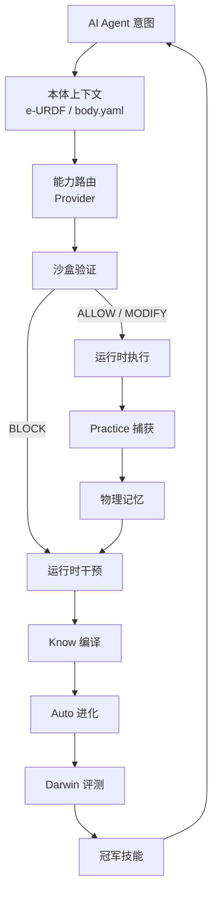

<div align="center">

# ROSClaw

### 面向物理 AI 与具身 Agent 的自进化运行时基础设施

**让 AI Agent 进入机器人身体，让每一次物理行动都可验证、可记忆、可修复、可进化。**

[](LICENSE)
[](https://www.python.org/)
[](https://docs.ros.org/)
[](https://mujoco.org/)
[](https://modelcontextprotocol.io/)
[](https://github.com/ros-claw/rosclaw)
[](mailto:ai@rosclaw.io)

[English](README.md) • **中文** • [快速开始](QUICKSTART.md) • [架构说明](ARCHITECTURE.md) • [文档](docs/) • [联系](mailto:ai@rosclaw.io)

</div>

---

ROSClaw 是一个面向 **物理 AI** 与 **具身 Agent** 的开源运行时基础设施。

它不是普通聊天机器人框架，不是简单的 LLM-to-ROS 封装，也不是单一仿真器或机器人工具集。

ROSClaw 试图补上 AI Agent 与真实机器人之间缺失的运行时层：本体建模、安全沙盒、能力路由、实践数据采集、物理记忆、运行时干预和技能进化。

> 从 Agent 意图 → 安全验证动作 → 物理执行轨迹 → 记忆沉淀 → 失败修复 → 技能进化。

```bash
curl -sSL https://rosclaw.io/get | bash
rosclaw firstboot
```

---

## ROSClaw 是什么？

ROSClaw **不是**另一个聊天机器人框架。  
**不是**简单的"大模型调用 ROS"工具。  
**不是**一堆零散的机器人工具集合。

ROSClaw 是 AI Agent 与物理世界之间的缺失运行时层：

- **本体建模（e-URDF）** — 用 e-URDF 描述机器人身体、传感器、执行器、约束、安全限制与能力。
- **安全沙盒验证** — 真实执行前，先在数字孪生中验证物理动作的安全性。
- **能力路由（Provider）** — 把 LLM、VLM、VLA、VLN、世界模型、经典机器人算法、Skill、Critic、Embedding 统一封装成可调用的物理能力。
- **实践数据采集（Practice）** — 记录机器人状态、传感器流、动作、工具调用、沙盒决策、失败与恢复过程。
- **物理记忆（Memory）** — 沉淀时空经验、成功模式、失败证据和可复用的物理知识。
- **运行时干预（How）** — 当 Agent 卡住、失败、危险或退化时，提供最小必要的恢复建议。
- **技能进化（Auto / Darwin）** — 通过闭环评估、补丁、Benchmark 和晋升，让 Skill 持续进化并支持回滚。

---

## 为什么需要 ROSClaw？

大模型可以规划、推理、写代码，但物理智能需要更多东西。

一个真正进入物理世界的 Agent 必须知道：

- 自己控制的是什么身体；
- 有哪些传感器和执行器；
- 哪些动作安全，哪些动作危险；
- 执行过程中发生了什么；
- 技能为什么失败；
- 下次如何恢复；
- 如何在不破坏安全边界的前提下持续进化。

ROSClaw 把这些能力组织成一个统一的物理 AI 运行时。

---

## 核心闭环

```text
Agent 意图
  ↓
机器人本体上下文
  ↓
能力路由
  ↓
安全沙盒验证
  ↓
物理执行
  ↓
实践数据采集
  ↓
物理记忆
  ↓
运行时干预
  ↓
知识编译
  ↓
自动进化
  ↓
Darwin 评测
  ↓
冠军技能
  ↓
更安全的下一次执行
```

核心原则：

> **每一次物理行动都应该被本体约束、被沙盒验证、被完整记录、被记忆沉淀、被运行时修复，并最终推动技能进化。**

---

## 快速开始

### 1. 安装

```bash
curl -sSL https://rosclaw.io/get | bash
```

### 2. First Boot

```bash
rosclaw firstboot
```

### 3. 环境检查

```bash
rosclaw doctor
```

### 4. 运行本地沙盒 Demo

```bash
rosclaw sandbox run --robot sim_ur5e --world tabletop --task reach
```

### 5. 打开 Dashboard

```bash
rosclaw dashboard --open
```

详细说明见 [QUICKSTART.md](QUICKSTART.md)。

---

## First Boot 开箱流程

`rosclaw firstboot` 会初始化本地物理 AI 运行时工作区：

1. 创建 `~/.rosclaw`
2. 生成默认运行时配置
3. 检查 Python、Docker、GPU、ROS 2、仿真依赖
4. 默认进入 local-only 模式
5. 可选配置 LLM / VLM / VLA Provider
6. 可选初始化机器人本体
7. 可选接入 Claude Code 或其他 MCP-compatible Agent
8. 运行本地 sandbox smoke test
9. 给出下一步推荐命令

详见 [docs/FIRSTBOOT.md](docs/FIRSTBOOT.md)。

---

## 开发者安装

如果你要参与 ROSClaw 本身开发：

```bash
git clone https://github.com/ros-claw/rosclaw.git
cd rosclaw
make setup
make test
```

详细说明见 [INSTALL.md](INSTALL.md)。

---

## CLI 速查

| 目标 | 命令 | 状态 |
|---|---|---|
| 初始化 ROSClaw | `rosclaw firstboot` | Stable |
| 检查环境健康 | `rosclaw doctor` | Stable |
| 初始化 Agent 工作区 | `rosclaw agent init claude-code` | Stable |
| 初始化机器人本体 | `rosclaw body init --robot unitree-g1` | Stable |
| 链接 e-URDF 本体 | `rosclaw body link-eurdf unitree-g1` | Stable |
| 配置模型 Provider | `rosclaw provider init` | Planned |
| 路由能力请求 | `rosclaw provider route --capability vision_language_action` | Planned |
| 运行沙盒验证 | `rosclaw sandbox run --robot sim_ur5e --world tabletop --task reach` | Stable |
| 启动实践数据采集 | `rosclaw practice start --sources dds,ros2,camera,agent,provider,sandbox,runtime` | Planned |
| 查询物理记忆 | `rosclaw memory query "last failed grasp near red cup"` | Stable |
| 请求运行时修复 | `rosclaw how advise --task g1_kick_ball --failure torso_pitch_overshoot` | Planned |
| 编译任务知识 | `rosclaw know compile --task g1_kick_ball` | Stable |
| 运行进化实验 | `rosclaw auto run --suite tabletop_grasp` | Planned |
| 评估候选 Skill | `rosclaw darwin eval --skill pick_cube` | Research |
| 打开 Dashboard | `rosclaw dashboard --open` | Stable |
| 搜索资产 | `rosclaw hub search g1` | Stable |
| 安装资产 | `rosclaw hub install <asset>` | Planned |

部分命令处于 **Planned** 或 **Research** 状态。详见 [docs/CLI.md](docs/CLI.md)。

---

## 核心运行时模块

### 本体层

| 模块 | 作用 |
|---|---|
| `e-urdf-zoo` | 机器人物理基因库：结构、关节、传感器、安全限制、能力、仿真元数据 |
| Body / Embodiment Runtime | 本地机器人实例状态、标定、维护与本体上下文 |

### 运行时与安全层

| 模块 | 作用 |
|---|---|
| `rosclaw-runtime` | 生命周期、配置、插件、事件路由与模块编排 |
| `rosclaw-sandbox` | 仿真优先验证、回放与"先沙盒后真实"安全边界 |
| `rosclaw-provider` | 跨模型、策略、机器人算法与工具的能力路由 |

### 实践与记忆层

| 模块 | 作用 |
|---|---|
| `rosclaw-practice` | 物理时间轴捕获：机器人状态、传感器、动作、工具调用、沙盒决策、失败 |
| `rosclaw-memory` | 时空物理记忆、失败证据、成功模式与可复用经验 |
| SeekDB Knowledge Plane | 机器人、Skill、Provider、Episode、失败与证据记录的结构化存储 |

### 干预与知识层

| 模块 | 作用 |
|---|---|
| `rosclaw-how` | 运行时干预：基于证据的最小修复建议 |
| `rosclaw-know` | 知识编译器：论文、文档、轨迹、失败、约束与任务卡片 |

### 进化与评测层

| 模块 | 作用 |
|---|---|
| `rosclaw-auto` | 自进化控制平面：提案、补丁、实验、冠军、死胡同 |
| `rosclaw-darwin` | Benchmark 压力、多随机种子验证、回归测试与技能晋升门控 |

### 开发者与可观测层

| 模块 | 作用 |
|---|---|
| `rosclaw-dashboard` | 物理轨迹查看器、运行时可观测、沙盒回放、记忆与进化面板 |
| `rosclaw-hub` | 物理 AI 资产分发与生命周期管理 |
| `rosclaw-forge` | 资产编译器：SDK、ROS 接口、Provider 清单、MCP Server、Skill Bundle |

---

## Hub 与资产

ROSClaw Hub 是**物理 AI 资产中心**，用于管理 Skill、Provider、Hardware MCP Server、Digital Twin、e-URDF Profile 与 Cognitive Wiki。

- **Skills** — 可复用的具身任务策略、恢复策略与技能图。
- **Providers** — LLM、VLM、VLA、VLN、世界模型、Critic、Embedding 与经典机器人算法。
- **Hardware MCP servers** — 面向 Agent 的机器人本体、传感器、工具与实验设备接口。
- **Digital twins** — 仿真世界、机器人资产、验证场景与回放环境。
- **e-URDF profiles** — 机器人本体定义、安全包络、能力与仿真元数据。
- **Cognitive wikis** — 任务卡片、失败分类、约束、证据与工程知识。

```bash
rosclaw hub login --registry https://hub.rosclaw.io --token $TOKEN
rosclaw hub sync
rosclaw hub search g1
rosclaw hub validate ./assets/manifest.yaml
```

Local-only 模式不需要 ROSClaw Cloud key。Cloud sync、私有资产与团队托管注册表可能需要认证。

详见 [docs/hub/README.md](docs/hub/README.md) 与 [docs/ASSETS.md](docs/ASSETS.md)。

---

## 完整示例：桌面抓取

```bash
./rosclaw demo tabletop-grasp --robot-id ur5e
```

系统会执行：

```text
1. Agent 接收任务："拿起红色杯子"
2. Provider 调用感知与技能能力
3. Memory 检索类似抓取经验
4. Skill Provider 生成抓取方案
5. Sandbox 预演动作并检查碰撞
6. Runtime 控制机器人执行
7. Practice 记录完整执行过程
8. Critic 判断是否成功
9. How 在失败时给出恢复建议
10. Auto 在重复失败后生成技能改进方案
11. Darwin 评估候选技能
12. 通过后晋升为 Champion Skill
```

---

## 安全边界

ROSClaw 坚持一个底线：

> **任何模型输出都不应该直接控制机器人。**

所有物理动作必须经过：

```text
Agent 意图
  ↓
Provider Schema
  ↓
本体约束
  ↓
Sandbox 验证
  ↓
Runtime Guard
  ↓
机器人控制器
```

基本规则：

- VLA 输出只是动作建议，不是电机命令；
- 世界模型只是神经预演，不是安全证明；
- MCP 是 Agent 工具接口，不是实时控制总线；
- 自动生成的 Skill 必须经过沙盒验证；
- 代码补丁进入生产环境前必须人工审批；
- 安全配置变更必须人工审批；
- 每个 Champion Skill 必须支持回滚。

详见 [docs/SAFETY.md](docs/SAFETY.md)。

---

## 系统架构



详见 [ARCHITECTURE.md](ARCHITECTURE.md)。

---

## 支持的集成

ROSClaw 支持与以下系统集成：

- ROS 2 与机器人中间件
- MCP-compatible Agent
- Claude Code 与自定义 Agent Runtime
- LLM / VLM / VLA / VLN Provider
- OpenAI-compatible 模型端点
- MuJoCo 等本地仿真后端
- 数字孪生与回放环境
- RLDS / LeRobot 风格数据导出
- MCAP / Parquet / JSONL 轨迹格式

各模块集成状态不同，详见 [docs/CLI.md](docs/CLI.md) 与 [ARCHITECTURE.md](ARCHITECTURE.md)。

---

## 文档

- [快速开始](QUICKSTART.md)
- [安装说明](INSTALL.md)
- [First Boot](docs/FIRSTBOOT.md)
- [架构说明](ARCHITECTURE.md)
- [CLI 参考](docs/CLI.md)
- [安全模型](docs/SAFETY.md)
- [物理 AI 资产](docs/ASSETS.md)
- [Hub](docs/hub/README.md)
- [贡献指南](CONTRIBUTING.md)

---

## 路线图

### 当前

- 本地运行时工作区
- 基于 e-URDF 的本体建模
- 沙盒验证
- 能力 Provider 路由
- Practice 轨迹捕获
- Hub 资产验证与本地注册表工作流
- Dashboard 与回放基础
- 测试套件与 Benchmark 脚手架

### 进行中

- First Boot 产品化
- Hardware MCP 自动安装流程
- 物理记忆闭环评估
- How 运行时干预集成
- Provider 容器生命周期
- Dashboard 物理轨迹查看器
- Darwin 评测驱动的技能晋升

### 研究

- 跨本体技能迁移
- VLA / VLN / 世界模型 Provider 编排
- 长周期物理记忆
- 自进化具身技能
- Sim-to-real 晋升门控
- 多 Agent 物理协作

---

## 参与贡献

欢迎贡献：

- 新机器人 e-URDF
- Hardware MCP Server
- Capability Provider
- 沙盒场景与世界
- Benchmark 任务
- 物理记忆评估器
- 运行时干预策略
- 技能进化流水线
- 文档与教程

详见 [CONTRIBUTING.md](CONTRIBUTING.md)。

---

## 联系我们

如果你对 ROSClaw、物理 AI 基础设施、具身 Agent、机器人安全运行时、物理记忆、自进化技能系统感兴趣，欢迎联系：

[**ai@rosclaw.io**](mailto:ai@rosclaw.io)

我们欢迎科研合作、机器人平台适配、Provider 接入、Benchmark / 评测任务贡献，以及工业物理 AI 场景合作。

---

## 许可证

MIT License.

---

<div align="center">

**ROSClaw — 面向物理 AI 的自进化运行时基础设施。**

</div>
