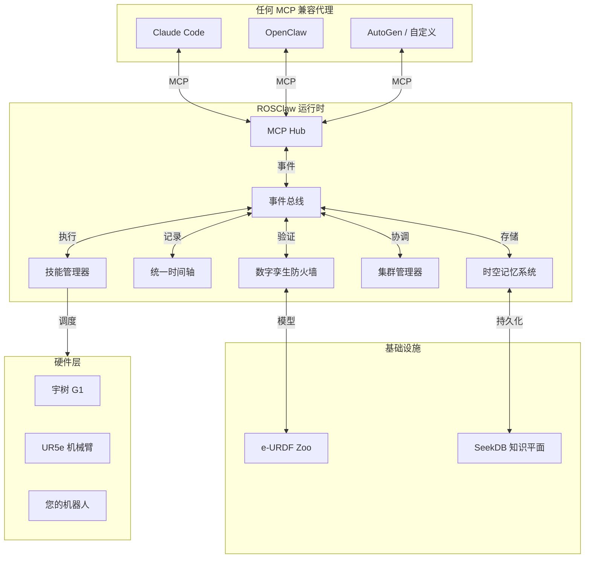

<div align="center">

# ROSClaw

**面向物理智能的开源基础设施**

*将通用人工智能锚定至物理宇宙。*

[](https://opensource.org/licenses/Apache-2.0)
[](https://docs.ros.org/)
[](https://mujoco.org/)
[](https://modelcontextprotocol.io/)

[English](README.md) • **中文** • [架构](#-架构) • [快速开始](#-快速开始)

<br/>

> *"教导一次，任意实体运行。共享技能，重塑现实。"*

</div>

<br/>

> **项目状态：V1.0 — Grounding 运行时**
>
> ROSClaw **不是**另一个 Agent 框架，也不是简单的 LLM-to-ROS API 封装器。它是为解决 AGI 终极瓶颈——**物理锚定问题（Physical Grounding Problem）**——而设计的**基础基础设施**。
>
> 我们提供将抽象 token 生成转化为安全、确定性、自我进化的物理交互的运行时环境。

## 愿景：超越 Agent 框架

如果说 OpenClaw 赋予了 AI Agent 推理能力，**ROSClaw 赋予它们重力。**

在人工智能的学术史中，**"符号接地问题（Symbol Grounding Problem）"** 是通往 AGI 最大的拦路虎。大模型知道"苹果"这个词，但它不知道苹果的重量、触感和摔在地上的声音。

**ROSClaw 的全部意义，就是解决大模型在三维宇宙中的 Grounding 问题！**

我们正在构建一个**物理技能的开放生态系统**。如果东京的开发者通过 ROSClaw 教机械臂"精密拧螺丝"技能，柏林的工厂工人可以立即下载该技能并在完全不同的人形机器人上部署——**无需重新编程**。

> **我们想象的未来**：一个物理智能像软件一样自由流动的技能市场——教导一次，任意实体运行。

---

## Grounding 架构

ROSClaw 通过一组相互关联的确定性引擎运行，由**事件总线（Event Bus）**统一协调，确保模块完全解耦：

### 1. e-URDF（物理锚定）
物理 AI 的"设备树"。定义任何机器人具身的绝对运动学和动力学极限。每台机器人携带其**物理 DNA**——质量、极限、传感器、安全包络。

### 2. 数字孪生防火墙（动作锚定）
基于 MuJoCo 的数字孪生，在执行前拦截、模拟并对齐 LLM 幻觉与牛顿物理定律。每次运动都在模拟中验证；如果预测到碰撞或扭矩过载，动作被阻止，Agent 自我纠正。

### 3. 实践捕获（时空轴锚定）
高频 MCAP 记录器，将 1000Hz 的传感运动数据与 1Hz 的 LLM 思维链在同一根时间轴上绑定。事件驱动的环形缓冲区实现 100 倍存储优化，同时保留 100% 有价值的数据。

### 4. 时空记忆系统（经验锚定）
基于 SeekDB 的海马体，将原始物理失败转化为结构化因果图谱。包括：
- **世界对象存储** —— 持久身份和场景图
- **轨迹记忆** —— DTW 相似性搜索
- **对象恒存（Object Permanence）** —— 被遮挡的对象不会消失；置信度随时间衰减，直到对象被重新检测到或标记为缺失
- **认知搜索** —— 语义 + 空间 + 时空检索

### 5. 集群协同（协作锚定）
通过事件总线实现多机器人协调。任务分解、角色分配、DDS 原生反射握手，实现物理世界中的协作。

---

## 架构



**关键洞察**：所有模块仅通过事件总线通信。禁止直接模块间调用。这确保了解耦，并使任何 Agent 无需硬件特定知识即可连接。

---

## 快速开始

### 1. 安装 ROSClaw

```bash
pip install rosclaw
```

### 2. 启动运行时

```python
from rosclaw.core import Runtime, RuntimeConfig

config = RuntimeConfig(
    robot_id="ur5e_001",
    robot_model_path="path/to/robot.urdf",
    enable_firewall=True,
    enable_memory=True,
)

runtime = Runtime(config)
runtime.initialize()
runtime.start()
```

### 3. 通过 MCP 连接

```json
{
  "mcpServers": {
    "rosclaw": {
      "command": "rosclaw-hub",
      "args": ["--enable-digital-twin"]
    }
  }
}
```

---

## 路线图

| Sprint | 聚焦 | 状态 |
|--------|------|------|
| **0** | 架构冻结 (RFC-0001) | 完成 |
| **1** | 物理基础 (e-URDF, CLI, MCP) | 完成 |
| **2** | Grounding 运行时 (事件总线, Agent Runtime) | 完成 |
| **3** | 动作锚定 (防火墙, MuJoCo) | 完成 |
| **4** | 实践捕获 (时间轴, MCAP) | 完成 |
| **5** | 时空记忆 (SeekDB, 对象恒存) | 完成 |
| **6** | 知识与恢复 (How, Know) | 计划中 |
| **7** | 进化飞轮 (Flywheel, Auto) | 计划中 |
| **8** | 集群智能 (DDS 反射) | 计划中 |
| **9** | Darwin 竞技场 (评测) | 计划中 |

---

## 安全架构

### 数字孪生防火墙

每次运动在物理执行之前都会在 MuJoCo 中验证：

```python
from rosclaw.core import Runtime, RuntimeConfig

config = RuntimeConfig(
    robot_model_path="ur5e.xml",
    safety_level="STRICT",
)
runtime = Runtime(config)
runtime.initialize()
```

### 验证层

- **e-URDF 软限制**：关节位置、速度、扭矩包络
- **MuJoCo 碰撞检测**：自碰撞和环境碰撞
- **语义安全**：禁区、工作空间边界、平滑度检查

---

## Grounding 闭环

```text
物理世界
        ↓
e-URDF DNA（物理锚定）
        ↓
Agent Runtime（LLM/MCP）
        ↓
Firewall（动作锚定）
        ↓
Practice（时空轴锚定）
        ↓
SeekDB（知识平面）
        ↓
Memory（经验锚定）
        ↓
How / Auto（技能锚定）
        ↓
Flywheel（进化锚定）
        ↓
Swarm（协作锚定）
        ↓
Darwin（评测锚定）
        ↓
物理世界
```

**我们的使命**：将物理交互转化为结构化经验，经验转化为记忆，记忆转化为技能，技能转化为进化。

---

<div align="center">
  <b>将通用人工智能锚定至物理宇宙。</b><br>
  <a href="https://rosclaw.io">rosclaw.io</a>
</div>
